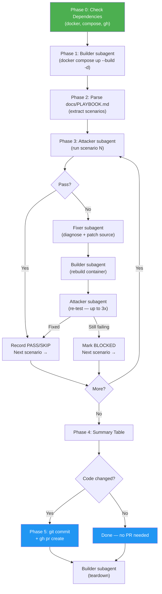

# Playbook Runner

> End-to-end test runner for the mmt-attacker playbook — spins up the Docker lab, executes all attack scenarios, auto-fixes failures, and opens a PR if code was changed.

## Highlights

- **Clean orchestrator architecture** — main agent coordinates three focused subagents (builder, attacker, fixer); never reads source files or runs Docker commands directly
- **Builder subagent** handles the full Docker lab lifecycle: startup, rebuild after fixes, teardown
- **Attacker subagent** executes one scenario at a time with clean context, returning a structured pass/fail result
- **Fixer subagent** diagnoses failures and makes the minimal source-code change needed — then hands off to builder for rebuild
- Dynamically parses `docs/PLAYBOOK.md` to extract scenarios — picks up new attacks automatically, no skill update needed
- Opens a GitHub PR automatically if any source files were modified during fixes

## When to Use

| Say this... | Skill will... |
|---|---|
| "run the playbook" | Execute all scenarios end-to-end |
| "test all attacks" | Check deps, start lab, run every attack |
| "execute playbook scenarios" | Run the full integration test suite |
| "validate the docker lab" | Start containers and verify all attacks work |

## How It Works



## Usage

```
/playbook-runner
```

Or trigger conversationally:

```
run the playbook end to end
test all attacks in the docker lab
execute all playbook scenarios and fix any errors
```

## Resources

| Path | Description |
|---|---|
| `agents/builder.md` | Docker lab lifecycle subagent prompt |
| `agents/attacker.md` | Scenario execution subagent prompt |
| `agents/fixer.md` | Failure diagnosis and fix subagent prompt |

## Output

- Per-scenario status reports (exit code, traceback check, structured output, timing)
- Fix-cycle reports for each attempted repair (from fixer + builder + attacker)
- Final summary table (PASS / FIXED / BLOCKED / SKIP counts)
- GitHub PR URL if source code was modified
