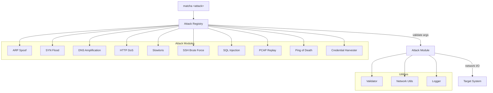

<p align="center">
  
</p>

[](LICENSE)
[](https://www.python.org/downloads/)

# Simulate 10 network attacks from one CLI

MMT-Attacker is a modular attack simulation toolkit for security testing. It covers network-layer attacks (ARP, SYN, DNS, ICMP), application-layer attacks (HTTP, SSH, SQL, Slowloris), PCAP replay, and credential harvesting -- all through a single CLI with built-in validation and logging.

[**Get Started**](#quick-start) | [**Playbook**](docs/PLAYBOOK.md) | [**Web Demo**](frontend/README.md)

---

## How It Works



Each attack inherits from `AttackBase`, which enforces argument parsing, input validation, and structured logging. The registry auto-discovers modules, so adding a new attack requires only a class and a one-line registration.

## Attack Coverage

| Layer | Attack | Description |
|---|---|---|
| Network | [ARP Spoofing](docs/PLAYBOOK.md#arp-spoofing) | MITM via ARP cache poisoning |
| Network | [SYN Flood](docs/PLAYBOOK.md#syn-flood-attack) | TCP SYN flood DoS |
| Network | [DNS Amplification](docs/PLAYBOOK.md#dns-amplification-attack) | DNS reflection/amplification |
| Network | [Ping of Death](docs/PLAYBOOK.md#ping-of-death-attack) | Oversized ICMP packets |
| Application | [HTTP DoS](docs/PLAYBOOK.md#http-dos-attack) | Multi-threaded HTTP flood |
| Application | [Slowloris](docs/PLAYBOOK.md#slowloris-attack) | Slow HTTP connection exhaustion |
| Application | [SSH Brute Force](docs/PLAYBOOK.md#ssh-brute-force-attack) | Credential brute forcing over SSH |
| Application | [SQL Injection](docs/PLAYBOOK.md#sql-injection-attack) | SQL injection testing |
| Application | [Credential Harvester](docs/PLAYBOOK.md#credential-harvester-attack) | Phishing/credential theft simulation |
| Replay | [PCAP Replay](docs/PLAYBOOK.md#pcap-replay-attacks) | Replay captured traffic with custom speed/looping |

## Key Features

- **Single CLI, 10 attacks** -- one tool replaces a fragmented collection of scripts
- **PCAP replay** -- replay captured traffic with speed control, looping, and interface selection
- **Web demo UI** -- React-based interactive walkthroughs with Mermaid flow diagrams
- **Pluggable architecture** -- add a new attack by subclassing `AttackBase` and registering it
- **Built-in validation** -- IP, port, interface, and parameter checks before execution
- **Structured logging** -- every attack logs events for post-analysis

## Quick Start

### Prerequisites

- Python 3.7+
- Root/sudo privileges (for raw socket attacks)
- Network interface in promiscuous mode (for packet injection)

### Install

```bash
git clone https://github.com/montimage/mmt-attacker.git
cd mmt-attacker
```

```bash
pip install -e .
```

### Verify

```bash
matcha --help
```

### Run an attack

```bash
matcha list
```

```bash
matcha http-dos --target-url http://example.com --threads 10
```

### Shell Completions

Enable tab-completion for your shell:

```bash
# bash — add to ~/.bashrc
eval "$(_MATCHA_COMPLETE=bash_source matcha)"

# zsh — add to ~/.zshrc
eval "$(_MATCHA_COMPLETE=zsh_source matcha)"

# fish — add to ~/.config/fish/config.fish
_MATCHA_COMPLETE=fish_source matcha | source
```

Or use the built-in helper to print the activation command:

```bash
matcha completions bash   # or zsh / fish
```

## Usage Examples

### PCAP Replay

```bash
matcha pcap-replay \
    --pcap-file capture.pcap \
    --interface eth0 \
    --speed 2.0
```

### ARP Spoofing

```bash
matcha arp-spoof \
    --target-ip 192.168.1.100 \
    --gateway-ip 192.168.1.1
```

### HTTP DoS

```bash
matcha http-dos \
    --target-url http://example.com \
    --threads 10
```

## Web Interface

The project includes an interactive web UI for educational attack demonstrations.

```bash
cd frontend && npm install
```

```bash
npm run dev
```

Opens at `http://localhost:3000`. Features: interactive attack walkthroughs, Mermaid flow diagrams, command generation with validation, and simulated execution results.

## Security Warning

This tool is for **authorized security testing and education only**. Before use:

- Obtain written authorization from the system owner
- Test only in controlled, isolated environments
- Follow responsible disclosure practices
- Comply with all applicable laws

Unauthorized use may be illegal. See [PLAYBOOK](docs/PLAYBOOK.md) for detailed ethical guidelines.

## Roadmap

- [x] GUI interface
- [x] Cloud deployment (Netlify)
- [ ] Additional attack vectors
- [ ] Enhanced reporting
- [ ] Docker containerization
- [ ] CI/CD pipeline
- [ ] API integration

## Get Started

```bash
pip install -e .
```

[**Read the Playbook**](docs/PLAYBOOK.md) | [**Try the Web Demo**](frontend/README.md) | MIT Licensed

---

<details>
<summary>Project Structure</summary>

```
mmt-attacker/
├── src/
│   ├── cli.py                     # Command-line interface
│   ├── attacks/                   # Attack implementations
│   │   ├── __init__.py           # Attack registry
│   │   ├── base.py               # Base attack class
│   │   ├── arp_spoof.py          # ARP spoofing attack
│   │   ├── syn_flood.py          # SYN flood attack
│   │   ├── dns_amplification.py   # DNS amplification attack
│   │   ├── http_dos.py           # HTTP DoS attack
│   │   ├── slowloris.py          # Slowloris attack
│   │   ├── ssh_brute_force.py    # SSH brute force attack
│   │   ├── sql_injection.py      # SQL injection attack
│   │   ├── pcap_replay.py        # PCAP replay functionality
│   │   ├── ping_of_death.py      # Ping of Death attack
│   │   └── credential_harvester.py # Credential harvesting
│   └── utils/                    # Utility functions
│       ├── __init__.py
│       ├── validator.py          # Input validation
│       ├── network.py            # Network utilities
│       └── logger.py             # Logging utilities
├── frontend/                     # Web interface (React + Vite)
│   ├── src/                      # Frontend source code
│   │   ├── components/          # React components
│   │   ├── pages/               # Page components
│   │   ├── data/                # Attack data and scenarios
│   │   └── utils/               # Utility functions
│   ├── package.json             # Node.js dependencies
│   └── vite.config.js           # Vite configuration
├── docs/                         # Documentation
│   ├── PLAYBOOK.md              # Detailed usage guide
│   └── images/                   # Documentation images
├── requirements.txt             # Python dependencies
└── README.md                    # Project overview
```

</details>

<details>
<summary>Adding New Attacks</summary>

1. Create a new module in `src/attacks/`
2. Inherit from `AttackBase`
3. Implement `add_arguments()`, `validate()`, and `run()`
4. Register in `src/attacks/__init__.py`

```python
from .base import AttackBase
from argparse import ArgumentParser
import logging

logger = logging.getLogger(__name__)

class NewAttack(AttackBase):
    name = "new-attack"
    description = "Description of the new attack type"

    def add_arguments(self, parser: ArgumentParser) -> None:
        parser.add_argument('--target', required=True, help='Target IP or hostname')
        parser.add_argument('--port', type=int, default=80, help='Target port')

    def validate(self, args) -> bool:
        if not self.validator.validate_ip(args.target):
            logger.error(f"Invalid target: {args.target}")
            return False
        return True

    def run(self, args) -> None:
        logger.info(f"Starting {self.name} against {args.target}:{args.port}")
        # Attack logic here
```

Register it:

```python
from .new_attack import NewAttack

ATTACKS = {
    # ... existing attacks ...
    "new-attack": NewAttack,
}
```

</details>

<details>
<summary>Contributing</summary>

1. Fork the repository
2. Create a feature branch
3. Commit your changes
4. Push to the branch
5. Create a Pull Request

Code requirements:
- PEP 8 style
- Include tests
- Update docs as needed
- Maintain backward compatibility

</details>

<details>
<summary>Support</summary>

1. Check the [documentation](docs/)
2. Search [existing issues](https://github.com/montimage/mmt-attacker/issues)
3. Email [developer@montimage.eu](mailto:developer@montimage.eu)
4. Create a new issue if needed

</details>

---

Built by [Montimage](https://montimage.eu)
