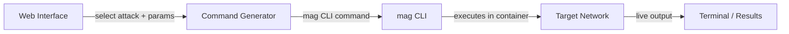

[](LICENSE)
[](CHANGELOG.md)
[](https://react.dev)
[](https://vitejs.dev)

# Network attack simulation for security research and training

MAG (Montimage Attack Generator) is a controlled network attack platform — a web interface + CLI tool covering 26 attack types across network, application, and credential layers. Built for security researchers, educators, and authorized penetration testers.

> **Access**: The `mag` CLI is free but private due to dual-use risk. [Request access →](#access)

---

## How It Works



The web interface lets you configure attacks visually and generates the exact `mag` CLI command to run. The CLI executes inside a Docker container with the necessary Linux capabilities (`NET_ADMIN`, `NET_RAW`).

---

## Attack Coverage

| Layer | Attacks |
|---|---|
| Network | ARP Spoof, SYN Flood, UDP Flood, ICMP Flood, Ping of Death, Smurf Attack, DHCP Starvation, MAC Flooding, VLAN Hopping, BGP Hijacking |
| Amplification | DNS Amplification, NTP Amplification |
| Application | HTTP DoS, HTTP Flood, Slowloris, SQL Injection, XSS, Directory Traversal, XXE, SSL Strip |
| Credential | SSH Brute Force, FTP Brute Force, RDP Brute Force, Credential Harvester |
| Protocol / Replay | MITM, PCAP Replay |

26 attack types · 2 scenarios each · realistic terminal output that mirrors real `mag` CLI behavior.

---

## Quick Start (Web Interface)

Install dependencies:

```bash
npm install
```

Start the dev server:

```bash
npm run dev
```

Open [http://localhost:3000](http://localhost:3000), select an attack, configure parameters, and copy the generated `mag` command.

Build for production:

```bash
npm run build
```

---

## mag CLI

The CLI is provided separately on request (see [Access](#access)).

Once installed:

```bash
mag list
```

```bash
mag info syn-flood
```

```bash
sudo mag syn-flood --target-ip 192.168.56.10 --target-port 80 --count 500
```

Run in Docker (no local Python setup):

```bash
docker build -t mag .
docker run --rm --cap-add NET_ADMIN --cap-add NET_RAW mag --help
```

Two-container lab (attacker + target):

```bash
docker compose up -d
docker compose exec attacker mag syn-flood --target-ip target --target-port 80 --count 200
```

---

## Access

The `mag` CLI is **free** but distributed privately to prevent misuse. To request access:

- Email: contact@montimage.eu
- Subject: `mag CLI access request`
- Include: your name, organization, and intended use (research, training, pentest engagement)

Access is granted to security researchers, educators, and authorized pentesters.

---

## Legal

This tool is for authorized use only. Run attacks only against systems you own or have explicit written permission to test. Unauthorized use may be illegal. Montimage accepts no liability for misuse.

---

## Contact

**Montimage**  
Website: https://www.montimage.eu  
Email: contact@montimage.eu  
GitHub: https://github.com/Montimage/mag-website

---

<details>
<summary>Project Structure</summary>

```
src/
├── components/
│   ├── layout/          # Header, Footer, Sidebar
│   ├── common/          # Button, Card, Input, Terminal, Alert, Badge
│   ├── attack/          # AttackTheory, AttackFlow, AttackParameters, AttackResults
│   └── home/            # Hero, feature sections
├── pages/
│   ├── Home.jsx
│   ├── Browse.jsx
│   ├── Docs.jsx
│   └── attacks/         # Dynamic attack pages
├── data/
│   ├── attacksData.js        # All 26 attack definitions
│   └── simulationEngine.js   # Realistic CLI output simulation
└── utils/
    ├── commandGenerator.js   # mag CLI command builder
    └── parameterValidator.js # Input validation
```

</details>

<details>
<summary>Tech Stack</summary>

| | |
|---|---|
| Framework | React 19 |
| Build | Vite 7 |
| Styling | Tailwind CSS 4 |
| Icons | Lucide React |
| Diagrams | Mermaid |
| Routing | React Router DOM |

</details>

<details>
<summary>Deployment (Netlify)</summary>

Deploy via CLI:

```bash
npm install -g netlify-cli
netlify login
netlify deploy --prod
```

Or connect the repo in the Netlify dashboard — `netlify.toml` is pre-configured.

Build settings:
- Build command: `npm run build`
- Publish directory: `dist/`
- Node version: 20

</details>

<details>
<summary>Adding a New Attack</summary>

1. Add definition to `src/data/attacksData.js`:

```javascript
'new-attack': {
  id: 'new-attack',
  name: 'New Attack',
  category: 'Network-Layer',
  description: '...',
  theory: { description, mechanism, impact },
  mermaidDiagram: '...',
  scenarios: [{ id, name, parameters }],
  safetyConsiderations: [...]
}
```

2. Add simulation logic to `src/data/simulationEngine.js`:

```javascript
const simulateNewAttack = (scenarioId, params) => {
  return { success, timeline, metrics, explanation }
}
```

Routes are created automatically — no router changes needed.

</details>

<details>
<summary>Parameter Validation</summary>

`parameterValidator.js` validates: IPv4/IPv6, port numbers (1–65535), URLs, file paths, JSON, email, hostnames, MAC addresses, number ranges.

</details>

<details>
<summary>Changelog</summary>

See [CHANGELOG.md](CHANGELOG.md).

</details>
