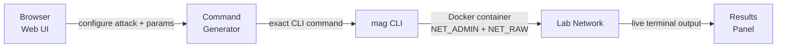

[](LICENSE)
[](CHANGELOG.md)
[](https://react.dev)
[](https://vitejs.dev)
[](https://mag.montimage.eu)

# A pentesting toolkit for humans & AI agents.

**MAG** (Montimage Attack Generator) is a network attack platform with two purposes:

- **Pentesters & AI agents** — run authorized attacks from the `mag` CLI, from your terminal, an AI agent, or any automated pentest pipeline.
- **Learners & researchers** — simulate and study attacks in the browser to understand how they work, no install required.

> **CLI access**: Free but private (dual-use risk). [Request access →](#access)

---

## How It Works



Configure visually in the browser → copy the generated `mag` command → run it in a Docker container against your lab target. The simulation engine mirrors real `mag` output so you can preview before executing.

---

## Attack Coverage

| Layer | Attacks |
|---|---|
| Network | ARP Spoof, SYN Flood, UDP Flood, ICMP Flood, Ping of Death, Smurf, DHCP Starvation, MAC Flooding, VLAN Hopping, BGP Hijacking |
| Amplification | DNS Amplification, NTP Amplification |
| Application | HTTP DoS, HTTP Flood, Slowloris, SQL Injection, XSS, Directory Traversal, XXE, SSL Strip |
| Credential | SSH Brute Force, FTP Brute Force, RDP Brute Force, Credential Harvester |
| Protocol / Replay | MITM, PCAP Replay |

**26 attack types · 2 scenarios each · realistic terminal output**

---

## Features

| | |
|---|---|
| Visual configurator | Select attack, fill parameters in a form, copy the exact CLI command |
| Simulation preview | See realistic terminal output before running anything |
| Attack theory | Each attack includes mechanism diagrams, impact analysis, and Mermaid flow |
| Docker-first | No local Python setup — one `docker run` command, isolated from host |
| Two-container lab | Built-in attacker + target compose setup for safe local demos |
| Parameter validation | IPv4/IPv6, ports, URLs, MACs, hostnames validated before you run |

---

## Quick Start — Web Interface

Clone and install:

```bash
git clone https://github.com/Montimage/mag-website
cd mag-website
npm install
```

Start dev server:

```bash
npm run dev
```

Open [http://localhost:3000](http://localhost:3000) — select an attack, configure parameters, copy the `mag` command.

Build for production:

```bash
npm run build
```

---

## Quick Start — mag CLI

> Requires CLI access. See [Access](#access).

List all available attacks:

```bash
mag list
```

Inspect an attack and its parameters:

```bash
mag info syn-flood
```

Run an attack (requires root):

```bash
sudo mag syn-flood --target-ip 192.168.56.10 --target-port 80 --count 500
```

---

## Docker Lab

No Python. No native dependencies. Full isolation.

Build the image:

```bash
docker build -t mag .
```

Verify it works:

```bash
docker run --rm --cap-add NET_ADMIN --cap-add NET_RAW mag --help
```

Spin up a two-container lab (attacker + target):

```bash
docker compose up -d
```

Run an attack against the target container:

```bash
docker compose exec attacker mag syn-flood --target-ip target --target-port 80 --count 200
```

---

## Access

The `mag` CLI is **free** but distributed privately to prevent misuse.

Email **contact@montimage.eu** with subject `mag CLI access request`.  
Include: name, organization, intended use (research / training / pentest engagement).

Access is granted to security researchers, educators, and authorized pentesters.

---

## Bug Reports & Feature Requests

Found a bug or have an idea for a new attack or feature? Open an issue on this repository:

- **Bug report** — unexpected behaviour, broken simulation, CLI flag mismatch
- **Feature request** — new attack type, agent integration improvement, UI enhancement
- **mag CLI issue** — wrong output, missing parameter, Docker problem

[Open an issue →](https://github.com/Montimage/mmt-attacker/issues)

We use this tracker for both the web interface and the `mag` CLI tool.

---

## Legal

Authorized use only. Run attacks against systems you own or have explicit written permission to test. Unauthorized use may be illegal. Montimage accepts no liability for misuse.

---

## Contact

**Montimage** · [www.montimage.eu](https://www.montimage.eu) · contact@montimage.eu  
GitHub: [Montimage/mag-website](https://github.com/Montimage/mag-website)

---

<details>
<summary>Project Structure</summary>

```
src/
├── components/
│   ├── layout/          # Header, Footer, Sidebar
│   ├── common/          # Button, Card, Input, Terminal, Alert, Badge
│   ├── attack/          # AttackTheory, AttackFlow, AttackParameters, AttackResults
│   └── home/            # Hero, feature sections
├── pages/
│   ├── Home.jsx
│   ├── Browse.jsx
│   ├── Docs.jsx
│   └── attacks/         # Dynamic attack pages
├── data/
│   ├── attacksData.js        # All 26 attack definitions
│   └── simulationEngine.js   # Realistic CLI output simulation
└── utils/
    ├── commandGenerator.js   # mag CLI command builder
    └── parameterValidator.js # Input validation
```

</details>

<details>
<summary>Tech Stack</summary>

| | |
|---|---|
| Framework | React 19 |
| Build | Vite 7 |
| Styling | Tailwind CSS 4 |
| Icons | Lucide React |
| Diagrams | Mermaid |
| Routing | React Router DOM |

</details>

<details>
<summary>Deployment</summary>

**GitHub Pages** (default, via CI):

Push to `main` — the CI workflow builds and deploys automatically to [mag.montimage.eu](https://mag.montimage.eu).

**Netlify** (alternative):

```bash
npm install -g netlify-cli
netlify login
netlify deploy --prod
```

Or connect the repo in the Netlify dashboard — `netlify.toml` is pre-configured.

Build settings: command `npm run build`, publish dir `dist/`, Node 20.

</details>

<details>
<summary>Adding a New Attack</summary>

1. Add definition to `src/data/attacksData.js`:

```javascript
'new-attack': {
  id: 'new-attack',
  name: 'New Attack',
  category: 'Network-Layer',
  description: '...',
  theory: { description, mechanism, impact },
  mermaidDiagram: '...',
  scenarios: [{ id, name, parameters }],
  safetyConsiderations: [...]
}
```

2. Add simulation logic to `src/data/simulationEngine.js`:

```javascript
const simulateNewAttack = (scenarioId, params) => {
  return { success, timeline, metrics, explanation }
}
```

Routes are created automatically — no router changes needed.

</details>

<details>
<summary>Parameter Validation</summary>

`parameterValidator.js` validates: IPv4/IPv6, port numbers (1–65535), URLs, file paths, JSON, email, hostnames, MAC addresses, number ranges.

</details>

<details>
<summary>Changelog</summary>

See [CHANGELOG.md](CHANGELOG.md).

</details>
