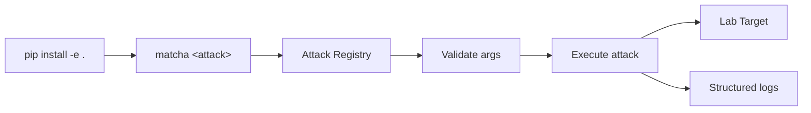

<p align="center">
  
</p>

[](LICENSE)
[](https://www.python.org/downloads/)
[](https://github.com/Montimage/mmt-attacker/actions/workflows/ci.yml)

# Network attack simulation for security education

A unified `matcha` CLI for running network-layer, application-layer, and replay attacks in controlled lab environments — built to teach how attacks work, not just that they exist.

[**Get Started**](#quick-start) | [**Playbook**](docs/PLAYBOOK.md) | [**Web Demo**](frontend/README.md)

---

## How It Works



Each attack inherits from `AttackBase`, which enforces argument parsing, input validation, and structured logging. The registry auto-discovers modules — adding a new attack requires only a class and a one-line registration.

## Attack Coverage

| Layer | Attacks |
|---|---|
| **Network** | [ARP Spoofing](docs/PLAYBOOK.md#arp-spoofing), BGP Hijacking, DHCP Starvation, [DNS Amplification](docs/PLAYBOOK.md#dns-amplification-attack), ICMP Flood, MAC Flooding, MITM, NTP Amplification, [Ping of Death](docs/PLAYBOOK.md#ping-of-death-attack), Smurf, [SYN Flood](docs/PLAYBOOK.md#syn-flood-attack), UDP Flood |
| **Application** | [Credential Harvester](docs/PLAYBOOK.md#credential-harvester-attack), Directory Traversal, FTP Brute Force, [HTTP DoS](docs/PLAYBOOK.md#http-dos-attack), HTTP Flood, RDP Brute Force, [Slowloris](docs/PLAYBOOK.md#slowloris-attack), [SQL Injection](docs/PLAYBOOK.md#sql-injection-attack), [SSH Brute Force](docs/PLAYBOOK.md#ssh-brute-force-attack), SSL Strip, VLAN Hopping, XSS, XXE |
| **Replay** | [PCAP Replay](docs/PLAYBOOK.md#pcap-replay-attacks) |

## Key Features

| Feature | What you get |
|---|---|
| Single CLI | All attacks through `matcha` — one interface for the entire curriculum |
| PCAP replay | Replay captured traffic with speed control and interface selection |
| Built-in validation | IP, port, interface, and parameter checks before execution |
| Structured logging | Every attack logs events for post-analysis and review |
| Pluggable architecture | Add an attack by subclassing `AttackBase` and registering it |
| Web demo | React-based interactive walkthroughs with Mermaid flow diagrams |
| Shell completions | Tab-completion for bash, zsh, and fish |

## Quick Start

**Prerequisites:** Python 3.8+ and root/sudo privileges (required for raw socket attacks)

Clone the repository:

```bash
git clone https://github.com/montimage/mmt-attacker.git
cd mmt-attacker
```

Install:

```bash
pip install -e .
```

Verify:

```bash
matcha --help
```

List all available attacks:

```bash
matcha list
```

Launch an attack (in a controlled lab environment):

```bash
matcha http-dos --target-url http://example.com --threads 10
```

### Shell Completions

```bash
# bash (~/.bashrc)
eval "$(_MATCHA_COMPLETE=bash_source matcha)"
```

```bash
# zsh (~/.zshrc)
eval "$(_MATCHA_COMPLETE=zsh_source matcha)"
```

```bash
# fish (~/.config/fish/config.fish)
_MATCHA_COMPLETE=fish_source matcha | source
```

Or print the activation command:

```bash
matcha completions bash   # or zsh / fish
```

## Usage Examples

### PCAP Replay

```bash
matcha pcap-replay \
    --pcap-file capture.pcap \
    --interface eth0 \
    --speed 2.0
```

### ARP Spoofing

```bash
matcha arp-spoof \
    --target-ip 192.168.1.100 \
    --gateway-ip 192.168.1.1
```

### HTTP DoS

```bash
matcha http-dos \
    --target-url http://example.com \
    --threads 10
```

### Attack Info

```bash
matcha info arp-spoof
```

## Web Interface

Install frontend dependencies:

```bash
cd frontend && npm install
```

Start the dev server:

```bash
npm run dev
```

Opens at `http://localhost:3000` — interactive attack walkthroughs, Mermaid flow diagrams, command generation with validation, and simulated execution results.

## Educational Use

MMT-Attacker is built for security courses, CTF preparation, and lab-based research. The web demo explains each attack's mechanism without executing real traffic. The CLI is for hands-on practice in isolated, authorized environments.

Use cases:
- University network security courses
- Cybersecurity workshop labs
- IDS/IPS detection research (generate known attack traffic)
- Personal study in a home lab

## Security Warning

This tool is for **authorized security testing and education only**. Before use:

- Obtain written authorization from the system owner
- Test only in controlled, isolated environments
- Follow responsible disclosure practices
- Comply with all applicable laws

Unauthorized use may be illegal. See [PLAYBOOK](docs/PLAYBOOK.md) for detailed ethical guidelines.

## Roadmap

- [x] GUI interface
- [x] Cloud deployment (Netlify)
- [x] CLI tool (`matcha`)
- [x] Shell completions
- [x] CI/CD pipeline
- [ ] Additional attack vectors
- [ ] Enhanced reporting
- [ ] Docker containerization
- [ ] API integration

## Get Started

```bash
pip install -e .
```

[**Read the Playbook**](docs/PLAYBOOK.md) | [**Try the Web Demo**](frontend/README.md) | [**Contributing**](CONTRIBUTING.md) | Apache 2.0 Licensed

---

<details>
<summary>Project Structure</summary>

```
mmt-attacker/
├── matcha/                        # CLI package
│   ├── cli.py                    # Click-based CLI entry point
│   ├── commands/                 # CLI commands
│   │   └── completions_cmd.py   # Shell completion support
│   └── attacks/                  # Attack implementations (auto-discovered)
├── src/
│   ├── attacks/                  # Attack implementations
│   │   ├── base.py              # Base attack class (AttackBase)
│   │   ├── arp_spoof.py         # ARP spoofing
│   │   ├── syn_flood.py         # SYN flood
│   │   ├── dns_amplification.py # DNS amplification
│   │   ├── http_dos.py          # HTTP DoS
│   │   ├── slowloris.py         # Slowloris
│   │   ├── ssh_brute_force.py   # SSH brute force
│   │   ├── sql_injection.py     # SQL injection
│   │   ├── pcap_replay.py       # PCAP replay
│   │   ├── ping_of_death.py     # Ping of Death
│   │   └── credential_harvester.py
│   └── utils/                   # Validators, network utils, logger
├── frontend/                     # React + Vite web demo
├── docs/                         # Documentation + playbook
├── pyproject.toml               # Package config (matcha entry point)
└── README.md
```

</details>

<details>
<summary>Adding New Attacks</summary>

1. Create a new module in `src/attacks/`
2. Inherit from `AttackBase`
3. Implement `add_arguments()`, `validate()`, and `run()`
4. Register in `src/attacks/__init__.py`

```python
from .base import AttackBase
from argparse import ArgumentParser
import logging

logger = logging.getLogger(__name__)

class NewAttack(AttackBase):
    name = "new-attack"
    description = "Description of the new attack type"

    def add_arguments(self, parser: ArgumentParser) -> None:
        parser.add_argument('--target', required=True, help='Target IP or hostname')
        parser.add_argument('--port', type=int, default=80, help='Target port')

    def validate(self, args) -> bool:
        if not self.validator.validate_ip(args.target):
            logger.error(f"Invalid target: {args.target}")
            return False
        return True

    def run(self, args) -> None:
        logger.info(f"Starting {self.name} against {args.target}:{args.port}")
        # Attack logic here
```

Register it:

```python
from .new_attack import NewAttack

ATTACKS = {
    # ... existing attacks ...
    "new-attack": NewAttack,
}
```

</details>

<details>
<summary>Contributing</summary>

1. Fork the repository
2. Create a feature branch
3. Commit your changes
4. Push to the branch
5. Create a Pull Request

Code requirements:
- PEP 8 style
- Include tests
- Update docs as needed
- Maintain backward compatibility

</details>

<details>
<summary>Support</summary>

1. Check the [documentation](docs/)
2. Search [existing issues](https://github.com/montimage/mmt-attacker/issues)
3. Email [developer@montimage.eu](mailto:developer@montimage.eu)
4. Create a new issue if needed

</details>

---

Built by [Montimage](https://montimage.eu)
