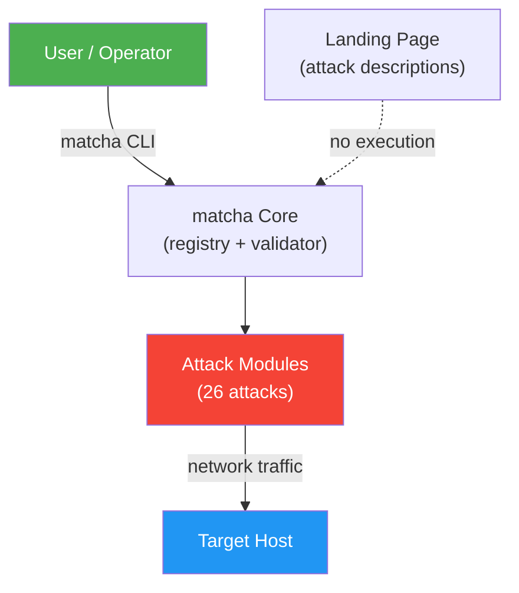
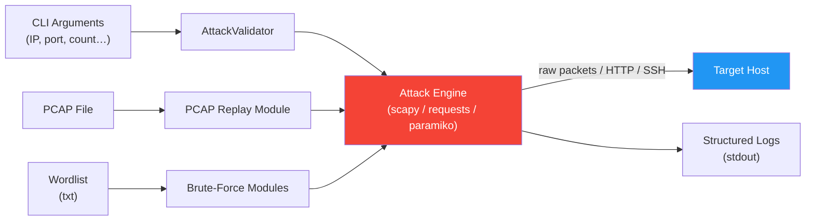

# MMT-Attacker

## 1. Overview

- **Tool name:** MMT-Attacker (`matcha` CLI)
- **Description:** A unified command-line toolkit providing 26 network and application-layer attack simulations for authorized security education and controlled lab testing. Designed for university courses, CTF preparation, IDS/IPS research, and security lab practice, it exposes each attack through a single `matcha` command with consistent input validation and structured logging.
- **Status:** TRL 4-5 — validated in controlled lab environments
- **Owners:** Luong NGUYEN (technical lead)
- **Who can master the tool:** Security researchers, students, and engineers with basic networking knowledge; root/sudo access required for raw-socket attacks
- **Repositories:** https://github.com/Montimage/mmt-attacker · https://pypi.org/project/mmt-attacker/
- **Stable branch:** `main`

## 2. Architecture and Components



- **matcha CLI** — Click-based entry point; auto-generates subcommands from the attack registry
- **Attack Registry** — Metadata store mapping attack names to classes and CLI parameters
- **AttackBase / AttackValidator** — Abstract base class with shared input validation (IP, port, interface, URL, file, domain, MAC, CIDR)
- **Attack Modules** — 26 `AttackBase` subclasses in `src/attacks/`; each implements `add_arguments()`, `validate()`, `run()`
- **Docker Lab** — Two-container compose setup: `attacker` (matcha CLI, NET_ADMIN/NET_RAW) + `target` (nginx, SSH, FTP)
- **Landing Page** — Static frontend describing available attacks; pure informational, no attack execution

## 3. Features and Use Cases

- **Key features:**
  - 26 attacks across 3 layers: 13 network (ARP spoof, SYN flood, DNS/NTP amplification, ICMP flood, BGP hijack, DHCP starvation, MAC flood, MITM, UDP flood, Ping of Death, Smurf, VLAN hop), 12 application (HTTP DoS/flood, Slowloris, SSH/FTP/RDP brute force, SQLi, XSS, XXE, SSL strip, directory traversal, credential harvester), 1 replay (PCAP replay)
  - Single `matcha` CLI with tab-completion (bash, zsh, fish)
  - Pre-execution input validation; structured timestamped logging
  - Pluggable architecture: add an attack by subclassing `AttackBase` and registering it (one line)
  - Isolated Docker two-container lab (attacker + vulnerable target)
  - Landing page describing each attack (no live execution)
- **Typical use cases:** University cybersecurity courses, IDS/IPS rule validation, CTF training, penetration testing lab exercises, M-Agent integration as a pentest module
- **Supported environments:** Linux/macOS (root required), Docker containers, isolated lab VMs

## 4. Installation

- **Prerequisites:** Python 3.8+, root/sudo, libpcap (`libpcap-dev`), Docker (for lab setup)
- **From PyPI:**
  ```bash
  pip install mmt-attacker
  ```
- **From source (dev):**
  ```bash
  git clone https://github.com/Montimage/mmt-attacker.git
  cd mmt-attacker && pip install -e ".[dev]"
  ```
- **One-line installer:**
  ```bash
  curl -sSL https://raw.githubusercontent.com/Montimage/mmt-attacker/main/install.sh | bash
  ```
- **Docker two-container lab:**
  ```bash
  docker compose up --build -d
  docker compose exec attacker matcha list
  ```
- **Verification:** `matcha --version` or `matcha list`

## 5. Configuration

- **Config files:** `pyproject.toml` (build/lint), `docker-compose.yml` (lab network)
- **Core parameters:** Attack options passed via CLI flags (target IP/URL, port, count, threads, interface, wordlists); no persistent config file
- **Security config:** Docker lab runs attacker as root with `NET_ADMIN` + `NET_RAW`; target container has intentionally weak credentials (`demo/password123`, `root/root123`) — for isolated lab use only
- **Project presets:** N/A — information not available

## 6. Usage Guide

- **Start lab:** `docker compose up --build -d` → `docker compose exec attacker bash`
- **Stop lab:** `docker compose down`
- **List attacks:** `matcha list`
- **Attack info:** `matcha info <attack-name>`
- **Example commands:**
  ```bash
  matcha syn-flood --target-ip 192.168.1.10 --target-port 80 --count 500
  matcha arp-spoof --target-ip 192.168.1.100 --gateway-ip 192.168.1.1
  matcha ssh-brute-force --target-host 192.168.1.10 --username root --password-file wordlist.txt
  matcha pcap-replay --pcap-file capture.pcap --interface eth0 --speed 1.5
  ```
- **Shell completion:** `eval "$(_MATCHA_COMPLETE=zsh_source matcha)"`
- **Landing page:** `cd frontend && npm install && npm run dev` → http://localhost:3000 (descriptions only, no attack execution)

## 7. Data and Models

- **Data types processed:** CLI arguments (IPs, ports, URLs, file paths), PCAP files (replay attack), wordlists (brute-force attacks), raw network packets (scapy)
- **Schemas:** No fixed schema; attack parameters defined per-class in `add_arguments()`
- **Output:** Structured timestamped log lines to stdout; no persistent DB or external schema



## 8. Testing and Quality

- **Running tests:**
  ```bash
  pytest tests/          # all tests
  pytest -m e2e          # end-to-end only
  ruff check .           # lint
  ```
- **Test suite:** 10 test files covering CLI parsing, registry, command factory, output formatting, and E2E attack execution
- **Known limitations:** Raw-socket attacks require root; E2E tests need a live target; Windows not officially supported

## 9. Deployment and Operations

- **Deployment patterns:** Local CLI (pip install), Docker CLI-only container, Docker two-container lab (recommended for demos)
- **Docker CLI-only:**
  ```bash
  docker build -t matcha .
  docker run --rm --cap-add NET_ADMIN --cap-add NET_RAW matcha syn-flood --help
  ```
- **Monitoring:** Structured stdout logs; no external monitoring integration
- **Performance:** Throughput depends on attack type and system; multi-threaded attacks configurable via `--threads`

## 10. Security and Compliance

- **Threat model:** Tool executes real attack traffic — must run in isolated networks only; target container is intentionally vulnerable
- **Access control:** No built-in AuthN/Z; access controlled by host OS permissions (root required) and network isolation
- **Firewall requirements:** Lab network should be air-gapped or on an isolated bridge (`lab` Docker network); never expose target ports to production networks
- **Legal notice:** Authorized use only; obtain written permission before testing any system not owned by the operator

## 11. Projects and Customer Usage

- **Projects:** N/A — information not available
- **Planned integration:** M-Agent (Montimage agentic platform) as a penetration testing module
- **External demos/pilots:** N/A — information not available

## 12. Roadmap and Open Points

- **Short-term plans:** Strengthen educational focus (guided scenarios, explanations tied to each attack); integrate as a pentest submodule within M-Agent
- **Technical debt:** `scripts/` directory contains standalone legacy scripts duplicating `src/attacks/` implementations; consolidation planned
- **Open questions:** Scope of M-Agent integration API; test coverage for E2E attacks in CI without a live target

## 13. References and Links

- **Repository:** https://github.com/Montimage/mmt-attacker
- **PyPI:** https://pypi.org/project/mmt-attacker/
- **Montimage:** https://www.montimage.eu
- **GitHub org:** https://github.com/Montimage
- **Docs:** `docs/PLAYBOOK.md`, `docs/DEMO.md`, `docs/DOCKER.md` (in-repo)
- **Contact:** https://github.com/Montimage/mmt-attacker/issues
